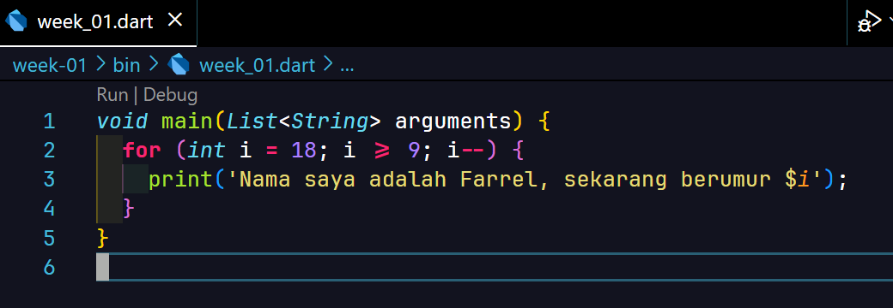
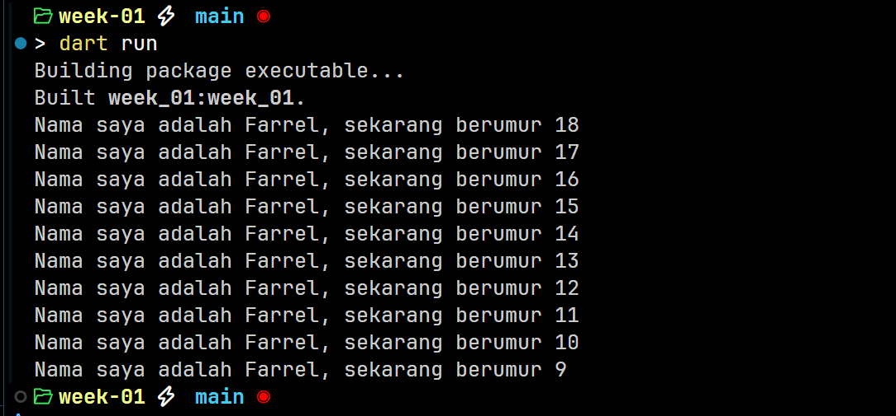
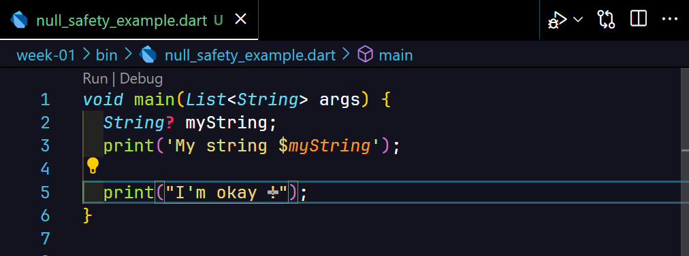
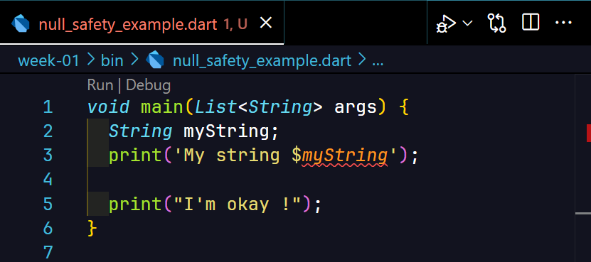
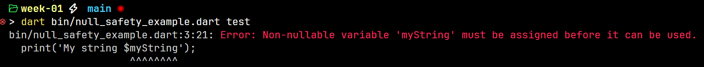
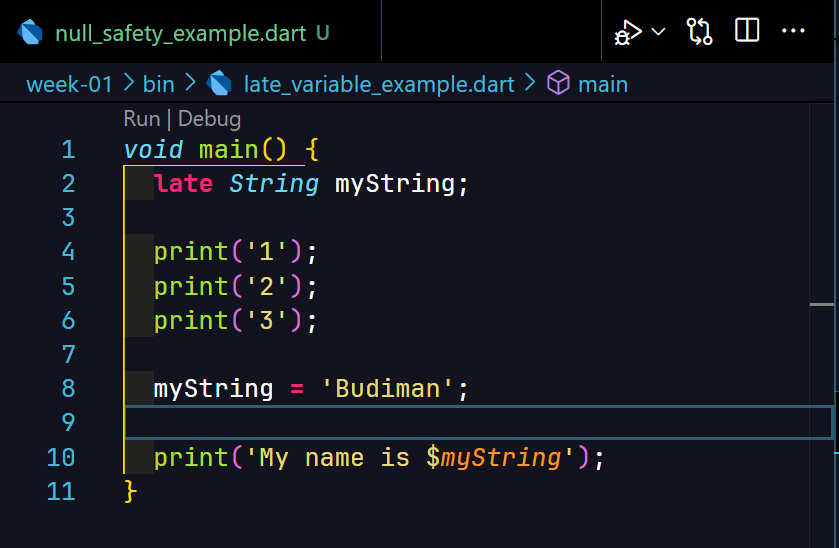

# Tugas Praktikum

## Soal 1

Modifikasilah kode pada baris 3 di VS Code atau Editor Code favorit Anda berikut ini agar mendapatkan keluaran (output) sesuai yang diminta!

**Jawab:**

## Soal 2

Mengapa sangat penting untuk memahami bahasa pemrograman Dart sebelum kita menggunakan framework Flutter ? Jelaskan!

**Jawab:** Karena sejatinya Flutter menggunakan bahasa pemrograman Dart secara keseluruhan untuk membuat aplikasi mobile. Jika menguasai bahasa pemrograman Dart, maka programmer tidak akan kesulitan dalam hal sintaks atau hal-hal lain yang ada di Flutter.

## Soal 3

Rangkumlah materi dari codelab ini menjadi poin-poin penting yang dapat Anda gunakan untuk membantu proses pengembangan aplikasi mobile menggunakan framework Flutter.

**Jawab:** Dart adalah bahasa pemrograman yang digunakan pada framework Flutter. Konsep bahasa pemrograman Dart ini terlihat sangat mirip dengan JavaScript dan Java. Style program yang ada pada JavaScript dapat memungkinkan program lebih fleksibel untuk dijalankan. Contohnya adalah variabel yang dibuat tidak memerlukan tipe data. Hanya perlu menggunakan tipe data `let` atau `const`. Style program di Dart kurang lebih seperti itu namun memungkinkan developer untuk menuliskan secara rinci tipe data yang ada seperti `List<String> myList` yang setara dengan `const list = []`.

Penggunaan tipe data tersebut cenderung memudahkan dalam proses pengembangan terutama aplikasi yang kompleks karena data-data yang ada dapat terlihat dengan jelas. Ini juga bisa meningkatkan aspek **maintainability**.

## Soal 4

Buatlah penjelasan dan contoh eksekusi kode tentang perbedaan Null Safety dan Late variabel !

**Jawab:** 

- Penggunaan **Null Safety**

    Berikut adalah contoh penggunaan **null safety** di Dart dengan memanfaatkan tanda `?`

    
    

    Hasilnya adalah program mampu berjalan dengan baik meski terdapat nilai yang `null` pada variable `myString`. 

    Sedangkan berikut adalah perbandingan penggunaan dengan tanpa menggunakan tanda `?` setelah tipe data dari variabel:

    
    

    Hasilnya adalah program bahkan belum bisa di-compile dengan baik sehingga seluruh program tidak bisa dijalankan sama sekali.

- Penggunaan **Late variabel**

    

    Penggunaan **late variable** pada kode tersebut dapat memungkinkan variabel dibuat terlebih dahulu dan bisa diinisialisasi dengan sebuah nilai di waktu mendatang. Namun perlu diingat variabel masih belum bisa digunakan karena belum menyimpan nilai sama sekali.