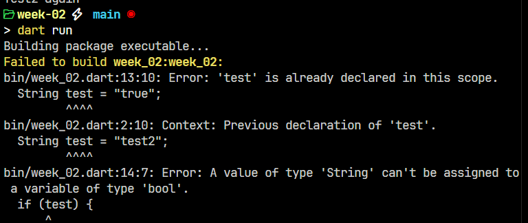

# Tugas Praktikum

Struktur proyek untuk minggu ke-2 ini adalah menggunakan struktur yang otomatis di-*generate* oleh Dart untuk program berbasis CLI (*Command Line Interface*). File utama berada pada folder [`bin/`](bin/) dengan nama file [`week_02.dart`](bin/week_02.dart). Dengan begitu, aplikasi hanya perlu dijalankan dengan menggunakan perintah `dart run`. Perintah tersebut akan secara otomatis mengeksekusi file [`week_02.dart`](bin/week_02.dart). 

Untuk beberapa rincian praktikum selanjutnya, file akan dibuat pada folder [`lib/`](lib/). Setiap praktikum akan memiliki file-nya sendiri. File tiap praktikum bisa dipanggil dengan mudah pada main file (`week_02.dart`) melalui proses import berikut:
```dart
import 'package:week_02/practicum_1.dart';
```

## Praktikum 1

File praktikum 1 terletak di [`lib/practicum_1.dart`](lib/practicum_1.dart)

**Langkah 1**


**Langkah 2**


Hasilnya tidak ada error sama sekali. Program berhasil melakukan print teks `Test2` dan `Test2 again`. Output tersebut dihasilkan dari pengecekan if-else yang ada di sana. Nilai pada variabel `test` mendapatkan nilai `true` pada pengecekan `else if (test == 'test2')` dan `if (test == 'test2')`, maka dari itu output tersebut dicetak.

**Langkah 3**




Hasilnya error karena variabel `test` dilakukan deklarasi secara berulang. Jika hanya perlu memperbarui nilai dari variabel, maka tidak perlu menuliskan tipe data variabel pada bagian awal. Selain itu, variabel dengan nilai string, tidak bisa langsung dicek di dalam kondisi `if (test)` seperti itu. Maka dari itu, bagian tersebut bisa diakali dengan menggunakan fungsi `test.isNotEmpty` yang akan mengembalikan nilai `true` jika variabel `test` tidak kosong dan `false` jika variabel kosong.


Dengan pembaruan yang ada, program bisa berjalan dengan baik tanpa ada error.

## Praktikum 2

File praktikum 2 terletak di [`lib/practicum_2.dart`](lib/practicum_2.dart)

**Langkah 1**


**Langkah 2**


Kode tersebut akan error karena variabel `counter` belum dideklarasikan.


Kode telah diperbaiki dengan membuat deklarasi variabel counter dengan tipe integer. Nilai tersebut didapat dari input pengguna di terminal.

**Langkah 3**


## Praktikum 3

File praktikum 3 terletak di [`lib/practicum_3.dart`](lib/practicum_3.dart)

**Langkah 1**


**Langkah 2**


Program bisa mencetak bilangan dari 0 hingga 26 yang diproses dari for-loop.

**Langkah 3**


Program yang dibuat akhirnya tidak memberikan output apa-apa bukan karena error tapi memang kode yang dibuat membuat perintah `print(i);` tidak akan dieksekusi selamanya. Kondisi `else if (i > 1 || i < 7)` yang akan membuat nilai akan terus `true`. Jika nilai `i` kurang dari `7`, maka `true`. Kemudian, jika nilai `i` lebih dari `1`, maka akan tetap `true` karena itu memenuhi kondisi `i > 1`.

## Tugas Praktikum

File tugas praktikum terletak di [`lib/last_practicum.dart`](lib/last_practicum.dart)

**Membuat program Dart untuk mengecek bilangan prima**


Bagian utama yang melakukan pengecekan bilangan prima adalah pada fungsi `isPrime()`. Cara kerja fungsi tersebut adalah membutuhkan parameter `num` bertipe `integer`. Jika nilai `num` kurang dari atau sama dengan 1, maka hasilnya adalah `false`. Kemudian dilakukan looping untuk mengecek apakah bilangan-bilangan di bawahnya bisa digunakan untuk membagi bilangan `num`. Proses perulangan dilakukan dari `0` hingga nilai akar kuadrat dari `num`.
