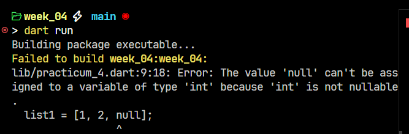
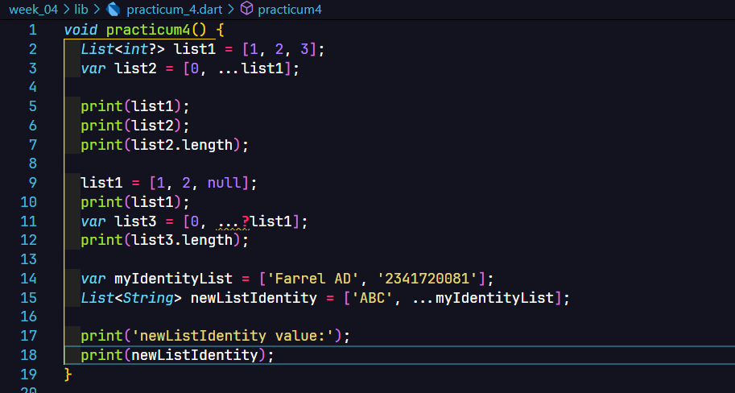
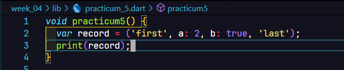
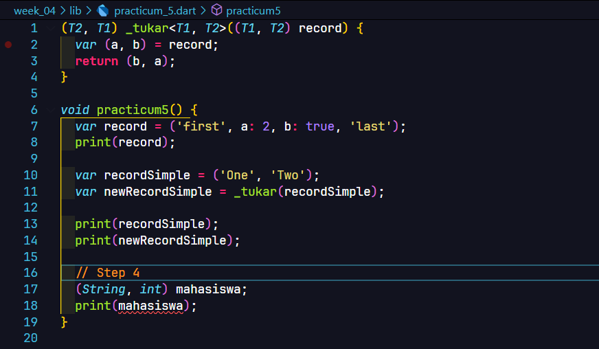

**Nama**: Farrel Augusta Dinata

**Kelas**: TI-3H

**NIM**: 2341720081

# Tugas Praktikum

Struktur proyek untuk minggu ke-4 ini adalah menggunakan struktur yang otomatis di-*generate* oleh Dart untuk program berbasis CLI (*Command Line Interface*). File utama berada pada folder [`bin/`](bin/) dengan nama file [`week_04.dart`](bin/week_04.dart). Dengan begitu, aplikasi hanya perlu dijalankan dengan menggunakan perintah `dart run`. Perintah tersebut akan secara otomatis mengeksekusi file [`week_04.dart`](bin/week_03.dart). 

Untuk beberapa rincian praktikum selanjutnya, file akan dibuat pada folder [`lib/`](lib/). Setiap praktikum akan memiliki file-nya sendiri. File tiap praktikum bisa dipanggil dengan mudah pada main file (`week_04.dart`) melalui proses import berikut:
```dart
import 'package:week_04/practicum_1.dart';
```

## Praktikum 1

File praktikum 1 terletak di [`lib/practicum_1.dart`](lib/practicum_1.dart)

**Langkah 1**


**Langkah 2**


**Langkah 3**


Dengan pembaruan yang ada, program bisa berjalan dengan baik tanpa ada error.

## Praktikum 2

File praktikum 2 terletak di [`lib/practicum_2.dart`](lib/practicum_2.dart)

**Langkah 1**


**Langkah 2**


**Langkah 3**


## Praktikum 3

File praktikum 3 terletak di [`lib/practicum_3.dart`](lib/practicum_3.dart)

**Langkah 1**


**Langkah 2**


**Langkah 3**


## Praktikum 4

File praktikum 4 terletak di [`lib/practicum_4.dart`](lib/practicum_4.dart)

**Langkah 1**


**Langkah 2**


**Langkah 3**








**Langkah 4**


**Langkah 5**


**Langkah 6**


## Praktikum 5

File praktikum 5 terletak di [`lib/practicum_5.dart`](lib/practicum_5.dart)

**Langkah 1**



**Langkah 2**


**Langkah 3**


**Langkah 4**




**Langkah 5**


## Tugas Praktikum

> File tugas praktikum terletak di [`lib/last_practicum.dart`](lib/last_practicum.dart)

**Pertanyaan:**

1. Jelaskan yang dimaksud Functions dalam bahasa Dart!

    **Jawab:** Function adalah suatu bentuk kode yang ada dalam bahasa pemrograman Dart dan juga bahasa pemrograman lain untuk memudahkan penggunaan instruksi yang sama secara berulang.

2. Jelaskan jenis-jenis parameter di Functions beserta contoh sintaksnya!

    **Jawab:**  Ada beberapa jenis parameter di function. Beberapa diantaranya adalah sebagai berikut:
    - Rquired positional parameter

        ```dart
        void greet(String name, int age) {
            print("Hello $name, you are $age years old.");
        }

        greet("Alex", 21);
        ```

        Required positional parameter berarti parameter yang wajib diisi dan urutan pengisian parameter harus sesuai dengan pembuatan function tersebut.


    - Optional positional parameter

        ```dart
        void greet(String name, [int? age]) {
            print("Hello $name, age: ${age ?? 'unknown'}");
        }

        greet("Alex");       // age = null
        greet("Alex", 21);   // age = 21
        ```

        Optional positional parameter sebenarnya mirip dengan required positional parameter. Namun, yang paling membedakan adalah ada parameter yang tidak harus diisi.

    - Named parameters

        ```dart
        void greet({required String name, int age = 0}) {
            print("Hello $name, you are $age years old.");
        }

        greet(name: "Alex", age: 21);
        greet(name: "Bob"); // age defaults to 0
        ```

        Named parameters terlihat seperti sebuah objek atau struktur data dengan struktur `key` - `value` yang ditaruh di parameter. Secara penggunaan, sebenarnya masih sama dengan required positional atau optional positional parameter. Namun, dengan menggunakan named parameters, nama dari parameter bisa ditulis pada saat penggunaan function tersebut. Ini biasanya cukup membantu jika parameter yang ada dari sebuah function cukup banyak sehingga perlu penamaan masing-masing argument agar tidak membingungkan satu sama lain.

    - Optional named parameters with default values

        ```dart
        void greet({String name = "Guest", int age = 18}) {
            print("Hello $name, age: $age");
        }

        greet();                       // Guest, 18
        greet(name: "Alex", age: 25);  // Alex, 25

        ```

        Parameter jenis ini digunakan sebagai pengembangan dari optional positional parameter. Function dengan jenis parameter ini memungkinkan sebuah nilai sudah terinisialisasi tanpa harus memberikan nilai pada saat pemanggilan function.

    - Mixed parameters

        ```dart
        void greet({required String name, int age = 0}) {
            print("Hello $name, you are $age years old.");
        }

        greet(name: "Alex", age: 21);
        greet(name: "Bob"); // age defaults to 0
        ```

        Mengkombinasikan antara parameter yang wajib diisi dan juga parameter yang opsional diisi.

    - Function type parameter

        ```dart
        void execute(int a, int b, int Function(int, int) operation) {
            print("Result: ${operation(a, b)}");
        }

        execute(5, 3, (x, y) => x + y); // Result: 8
        ```

        Parameter jenis ini sebenarnya terlihat sama dengan jenis paramter lain. Hal yang paling membedakan adalah, function ini menerima function lain agar bisa dieksekusi di dalam function ini. Ini biasanya dinamakan sebagai **callback function**.

    - Generic type parmeter
    
        ```dart
        T first<T>(List<T> items) {
            return items[0];
        }

        print(first<int>([1, 2, 3]));
        print(first<String>(["a", "b"]));
        ```

        Generic type parameter memungkinkan jenis tipe data apapun agar bisa diterima oleh function. Pada penggunaannya, saat pemanggilan function, harus diberikan tipe datanya dulu.

3. Jelaskan maksud Functions sebagai first-class objects beserta contoh sintaknya!

    **Jawab:** Function sebagai first class object berarti function dianggap sama seperti objek-objek lain seperti: `number`, `string`, dan lain-lain. Contohnya sebagai berikut:
    
    ```dart
    void greet(String name) {
        print("Hello, $name!");
    }

    void main() {
    var sayHello = greet; // Assign function to variable
    sayHello("Alice");    // Call through variable → Hello, Alice!
    }
    ```

    Dari kode di atas bisa dilihat bahwa variabel `sayHello` diberikan nilai function `greet`. Dengan demikian, jika memanggil atau menggunakan variabel `sayHello`, maka otomatis sama saja memanggil function `greet`.

4. Apa itu Anonymous Functions? Jelaskan dan berikan contohnya!

    **Jawab:** Anonymous function berarti function tersebut tidak memiliki struktur yang secara umum seperti function pada umumnya. Biasanya function jenis ini digunakan untuk membuat sebuah instruksi yang memang perlu harus dibuat sebagai function dan dieksekusi di saat itu juga.

    Contohnya sebagai berikut:
    ```dart
    void main() {
        var multiply = (int a, int b) {
            return a * b;
        };

        print(multiply(4, 5)); // 20
    }
    ```

5. Jelaskan perbedaan Lexical scope dan Lexical closures! Berikan contohnya!

    **Jawab:** 
    Lexical scope adalah konsep di mana variabel yang dideklarasikan di dalam suatu blok kode hanya bisa diakses di dalam blok tersebut dan blok turunannya. Jadi, ruang lingkup variabel sudah ditentukan saat penulisan kode, bukan saat eksekusi.

    Lexical closure adalah kemampuan sebuah function untuk "mengunci" atau mengingat variabel dari scope di mana function tersebut dibuat, walaupun function itu dieksekusi di luar scope asalnya. Closure bisa mengakses variabel dari parent scope meskipun parent scope sudah selesai dieksekusi.

    Contoh:
    ```dart
    void main() {
      int angka = 10; // Lexical scope: hanya bisa diakses di main dan turunannya

      void tampilAngka() {
        print(angka); // Closure: tampilAngka bisa akses angka walaupun dipanggil di luar
      }

      tampilAngka(); // Output: 10
    }
    ```

6. Jelaskan dengan contoh cara membuat return multiple value di Functions!

    **Jawab:**
    Di Dart, untuk mengembalikan lebih dari satu nilai dari sebuah function, biasanya menggunakan struktur data seperti List, Map, atau membuat class khusus. Cara paling sederhana adalah dengan List atau Map.

    Contoh menggunakan List:
    ```dart
    List<int> hitung(int a, int b) {
      int tambah = a + b;
      int kali = a * b;
      return [tambah, kali];
    }

    void main() {
      var hasil = hitung(3, 4);
      print("Tambah: ${hasil[0]}, Kali: ${hasil[1]}");
    }
    ```

    Contoh menggunakan Map:
    ```dart
    Map<String, int> operasi(int a, int b) {
      return {
        'tambah': a + b,
        'kali': a * b,
      };
    }

    void main() {
      var hasil = operasi(5, 2);
      print("Tambah: ${hasil['tambah']}, Kali: ${hasil['kali']}");
    }
    ```