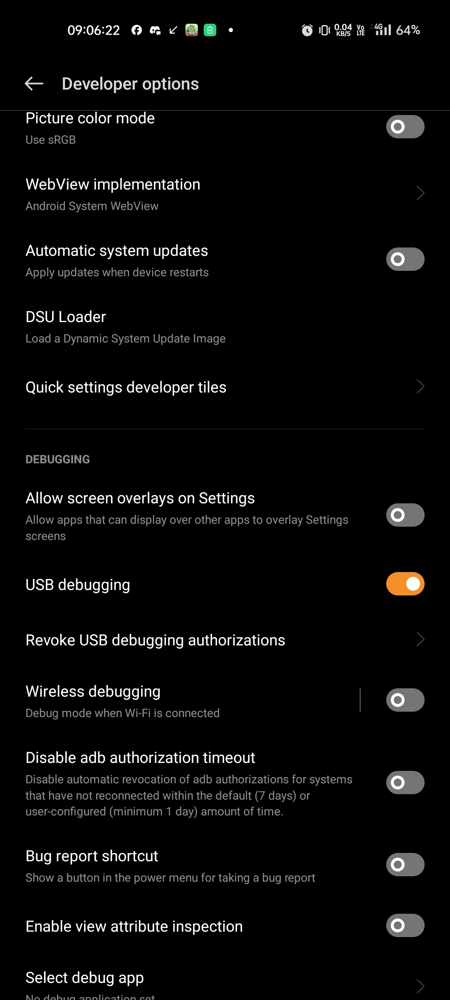
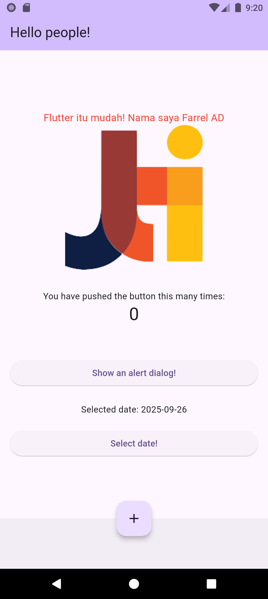
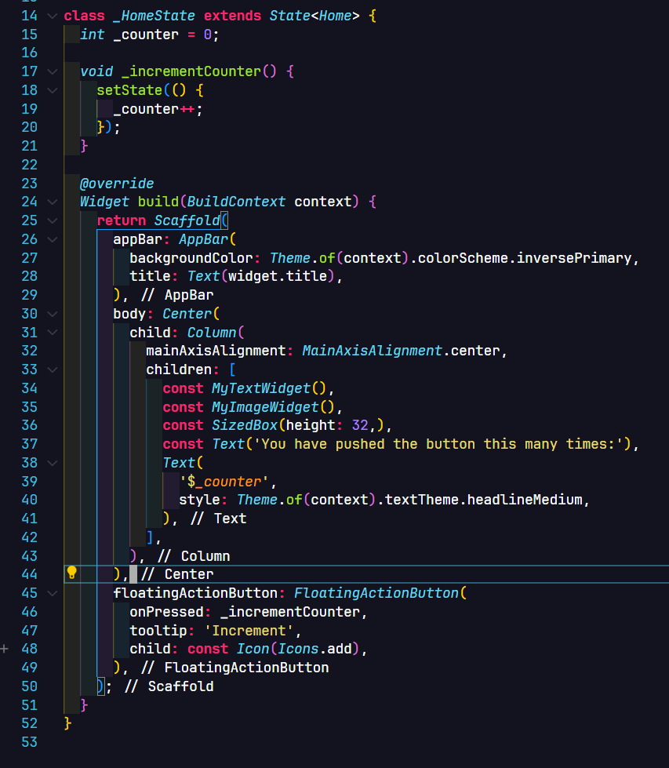
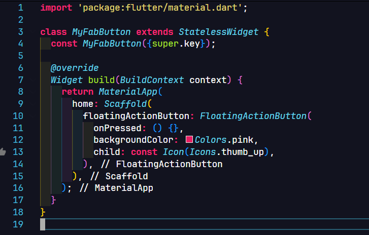

**Nama**: Farrel Augusta Dinata

**Kelas**: TI-3H

**NIM**: 2341720081

# Tugas Praktikum

## Praktikum 1 - Membuat Proyek Flutter

**Langkah 1 - Membuat Proyek Flutter**

**Langkah 2 - Hasil Proyek Flutter**

## Praktikum 2 - Menghubungkan aplikasi Flutter dengan Perangkat HP

**Langkah 1 - Menghubungkan dengan Perangkat Android melalui USB**

- Mengaktifkan mode developer

    

- Masuk ke menu developer options

    

- Menyalakan USB debugging

    

- Menjalankan aplikasi Flutter di perangkat Android yang terhubung

    

**Langkah 2 - Menghubungkan dengan Perangkat Android melalui Wi-Fi**

- Mengaktifkan wireless debugging

    

- Mengecek IP address dan kode pairing di HP

    

- Menghubungkan HP secara wireless melalui perintah ADB di komputer

    

- Menjalankan aplikasi Flutter

    

    

## Praktikum 3 - Membuat Repositori GitHub

**Langkah 1**

## Praktikum 4 - Membuat Widget Dasar

**Langkah 1 - Text Widget**

**Langkah 2 - Image Widget**

**Langkah 2 - Menggunakan Widget di Layar Aplikasi**

## Praktikum 5 - Menerapkan Widget Material Design dan Cupertino Design

**Langkah 1 - Cupertion Button dan Loading Bar**

**Langkah 2 - Floating Action Button (FAB)**

**Langkah 3 - Scaffold Widget**

**Langkah 4 - Dialog Widget**

**Langkah 5 - Input dan Selection Widget**

**Langkah 6 - Date and Time Pickers**

