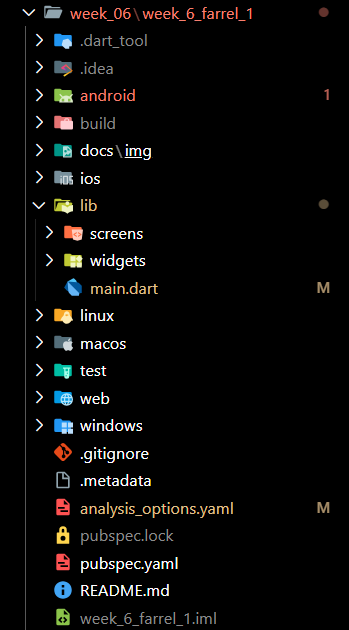
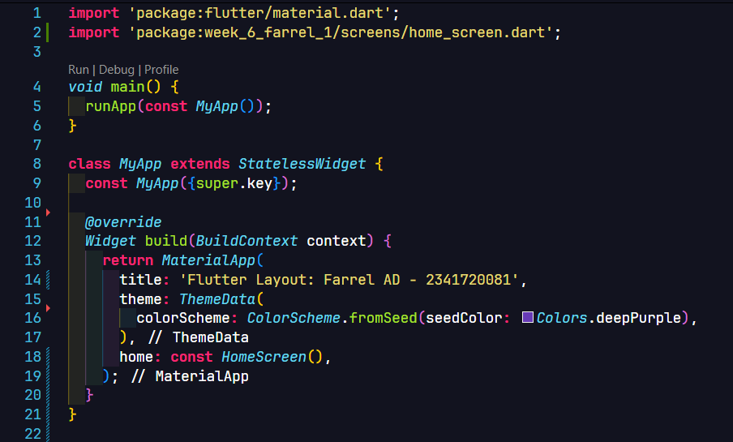
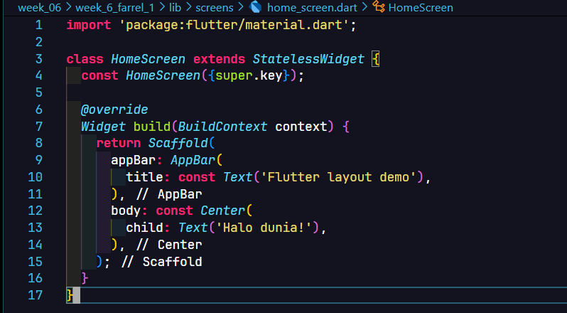
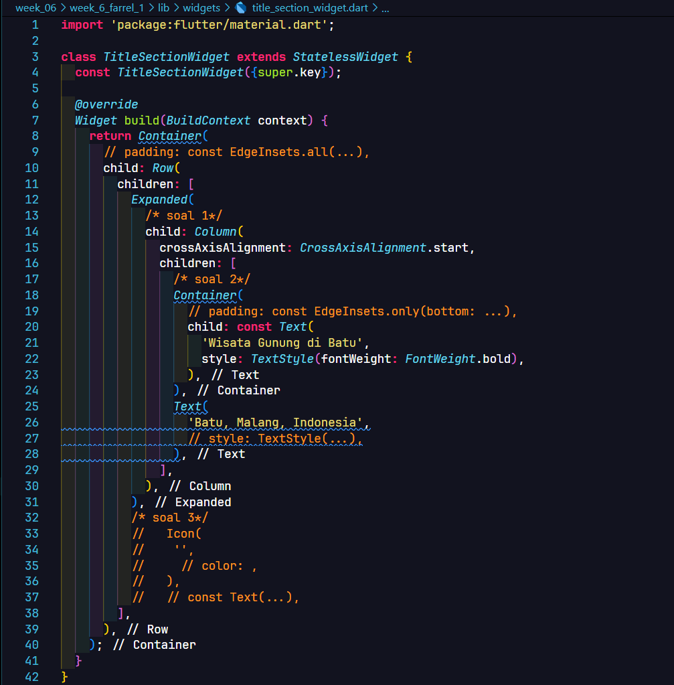
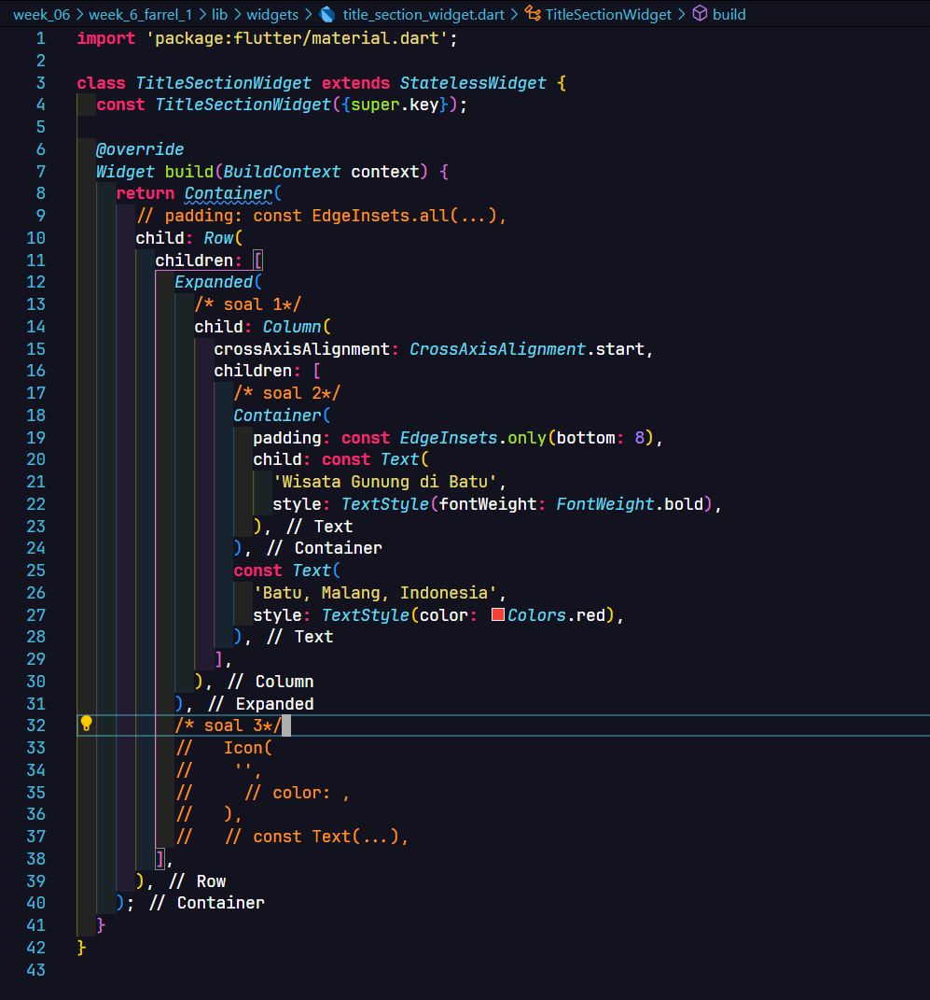
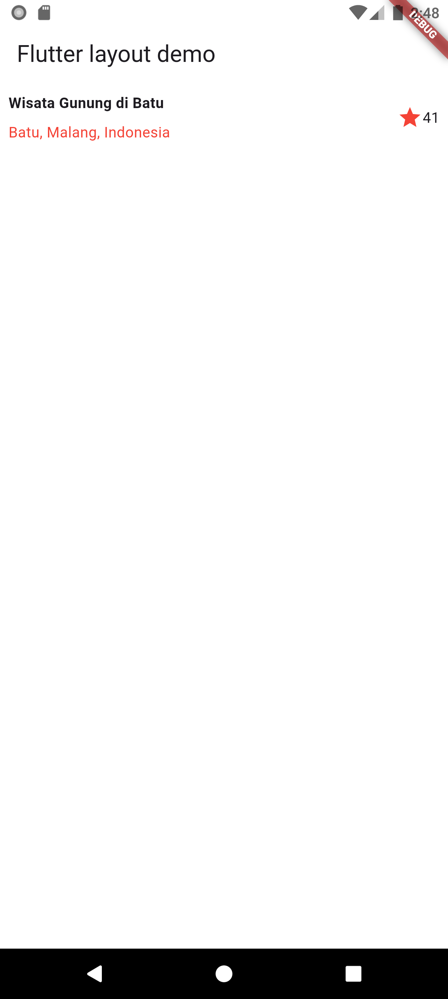
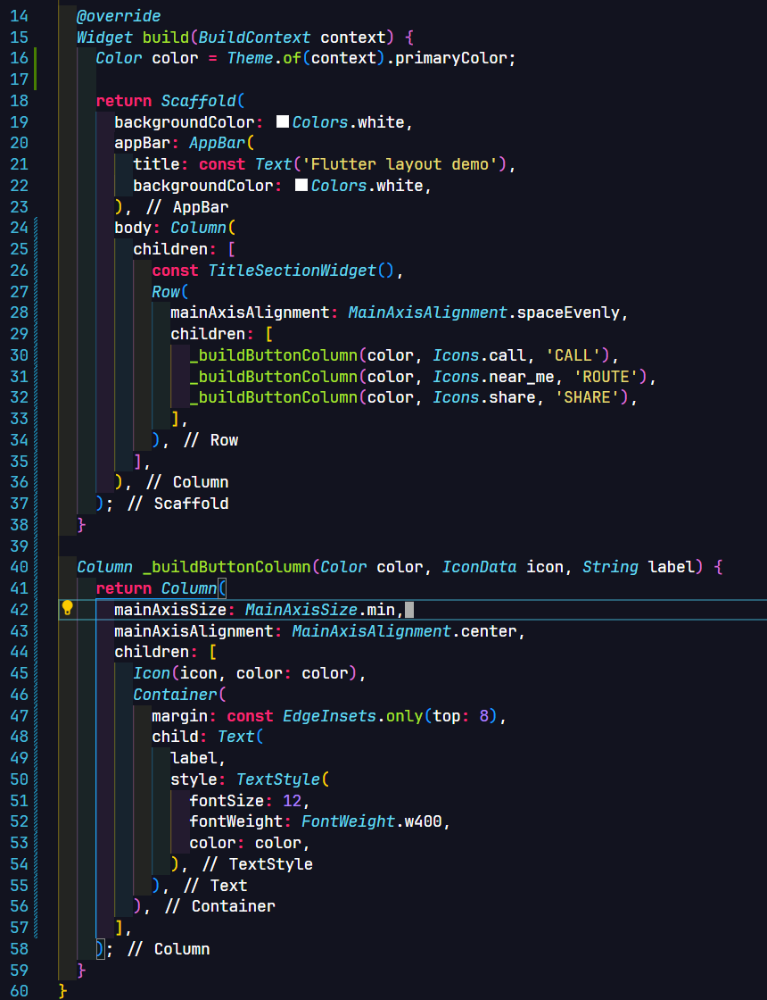
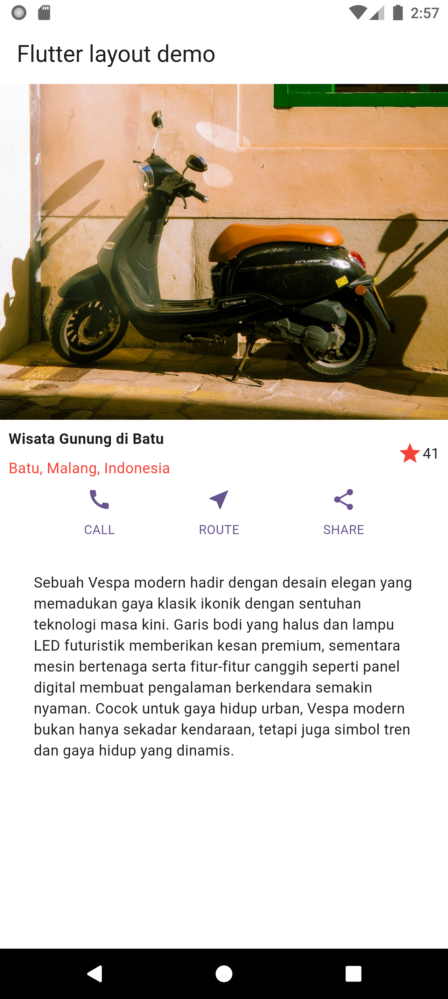
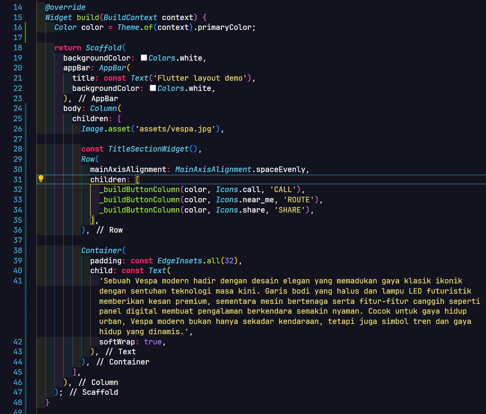
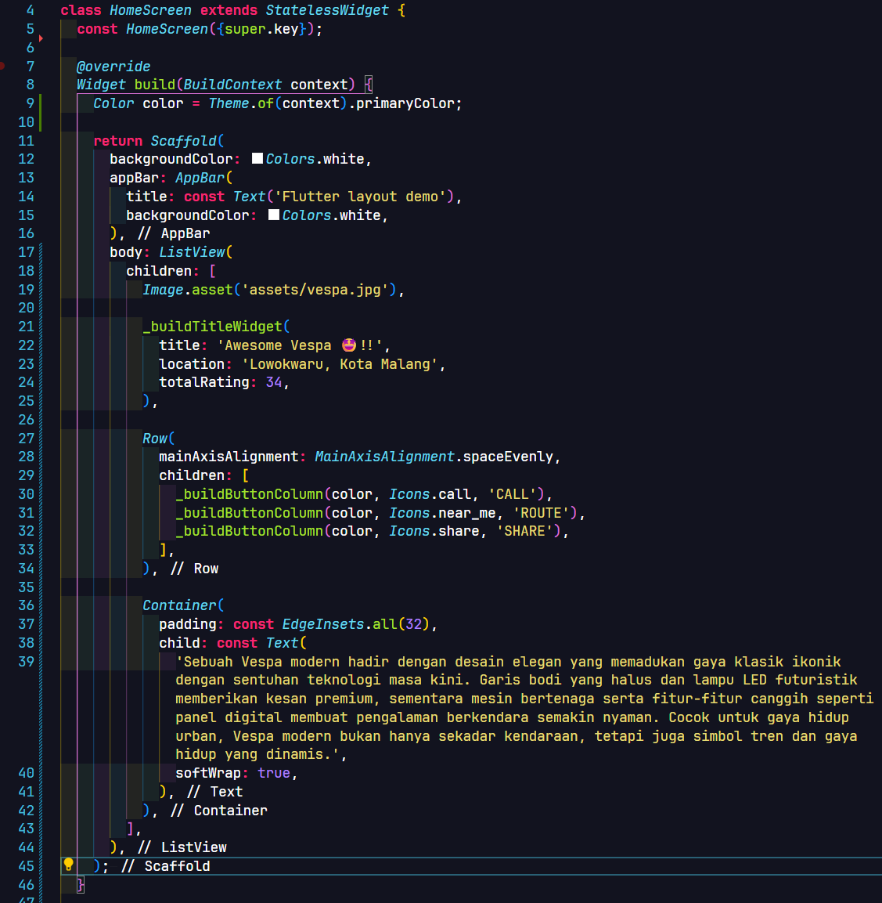

**Nama**: Farrel Augusta Dinata

**Kelas**: TI-3H

**NIM**: 2341720081

---

# Tugas Praktikum 1 - Konsep Layout di Flutter

## Praktikum 1 - Membangun Layout Flutter

**Langkah 1**

**Langkah 2**

**Langkah 3**

**Langkah 4**

## Praktikum 2 - Implementasi Button Row

**Langkah 1-2**

**Langkah 3**

## Praktikum 3 - Implementasi Text Section

**Langkah 1-3**

## Praktikum 4 - Implementasi Image Section

**Langkah 1-3**

# Tugas Praktikum 2 - Navigasi dan Rute

## Praktikum 1

*SOON!*