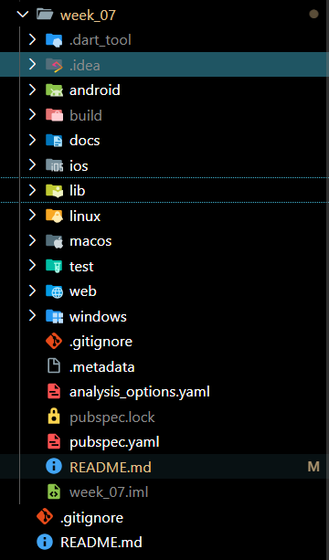
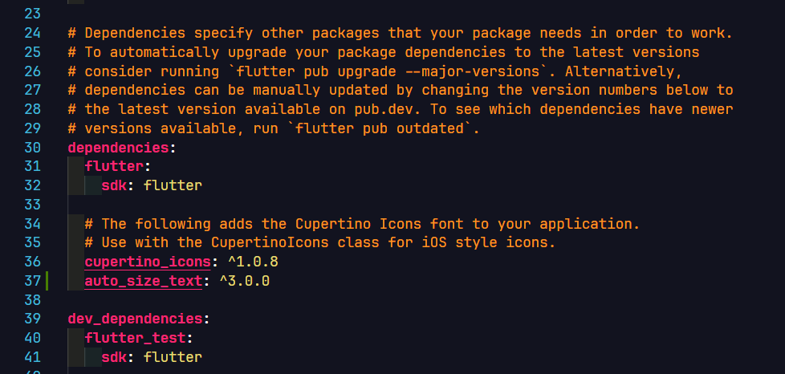
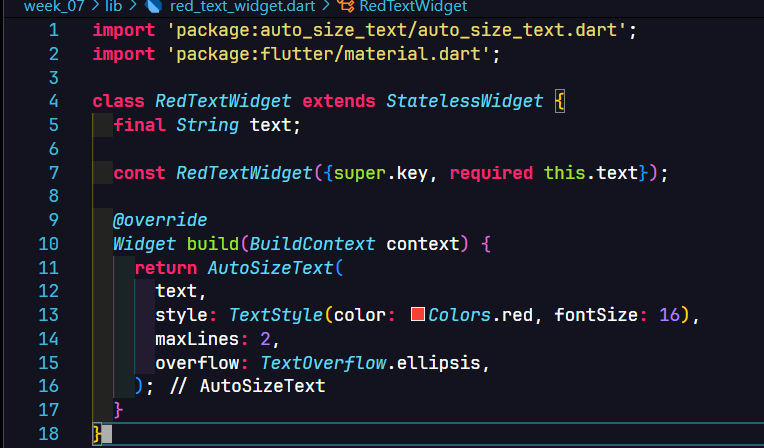
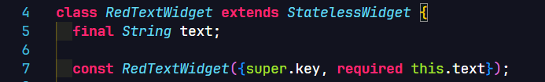

**Nama**: Farrel Augusta Dinata

**Kelas**: TI-3H

**NIM**: 2341720081

---

# Tugas Praktikum 1

**Langkah 1 - Membuat Proyek Flutter Baru**



**Langkah 2 - Menambahkan Plugin**




Langkah ke-2 bertujuan untuk menambahkan package baru dari internet ke proyek Flutter yang sedang dimiliki saat ini. Flutter sendiri sudah memiliki repositori tersendiri untuk menyimpan package-package yang bisa digunakan pada proyek Dart atau Flutter. Pihak Flutter menyediakan pada website `pub.dev`.

**Langkah 3 - Membuat Widget `red_text_widget.dart`**


**Langkah 4 - Tambah Widget `AutoSizeText`**



**Langkah 5 - Membuat Variabel `text` dan parameter di constructor**



Pembuatan kode di atas bertujuan agar widget bisa menerima input teks ketika class widget tersebut dipanggil. Input ini akan ditaruh pada parameter constructor widget. Contohnya seperti ini:
```dart
RedTextWidget(text: 'Saya teks 1')


RedTextWidget(text: 'Saya teks 2')


RedTextWidget(text: 'Saya teks 3')
```

**Langkah 6 - Menambahkan Widget di `main.dart`**


Kode pada langkah 6 ini memanggil widget yang telah dibuat sebelumnya dan akan digunakan pada halaman utama aplikasi. Perbedaannya hanya terletak pada hasil tampilan aplikasi. Warna dan teks yang dimiliki berbeda. 

