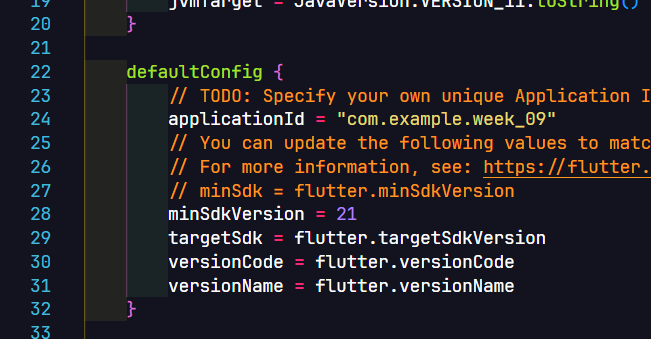
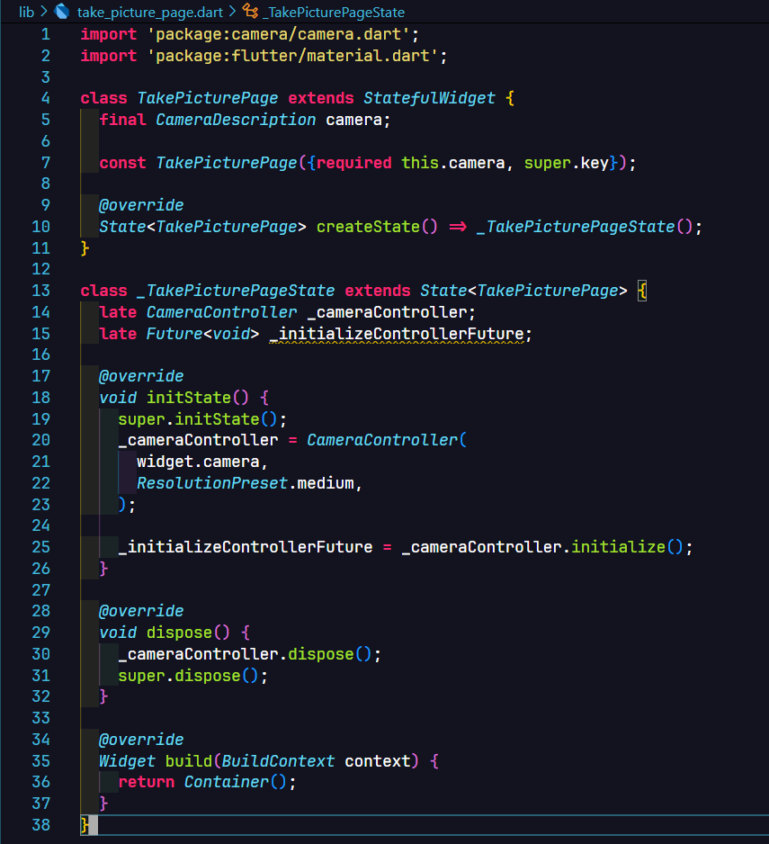
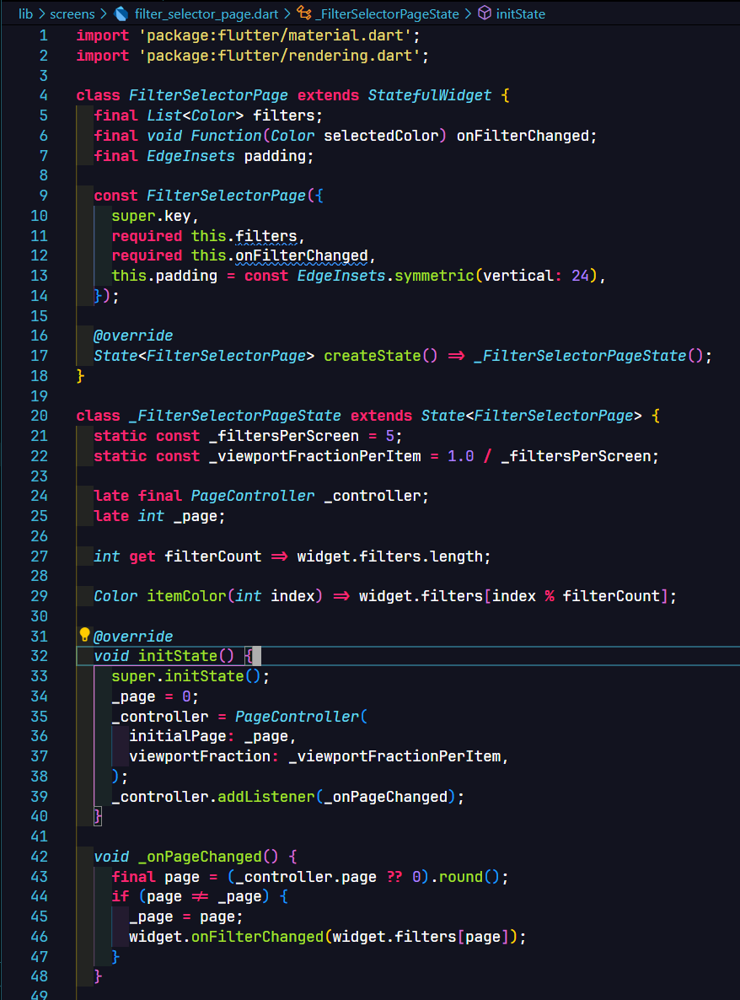
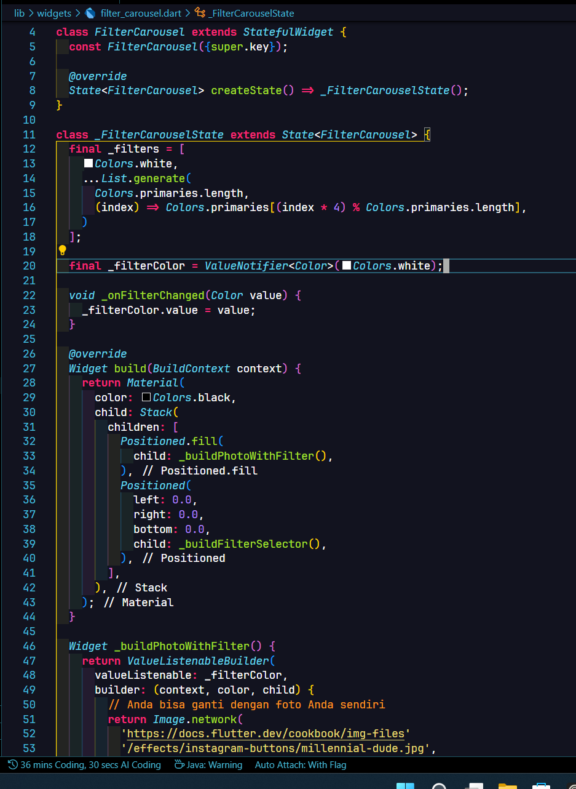
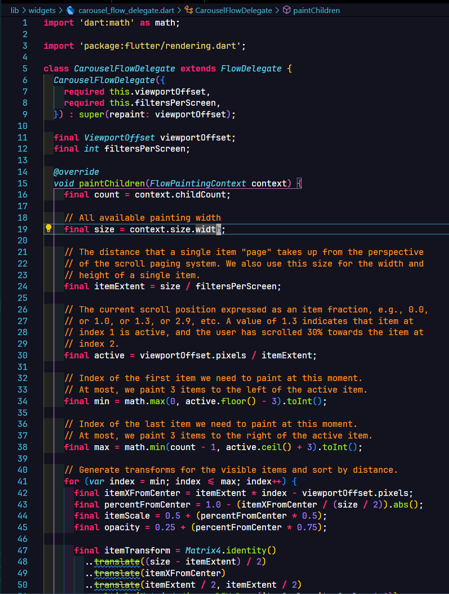
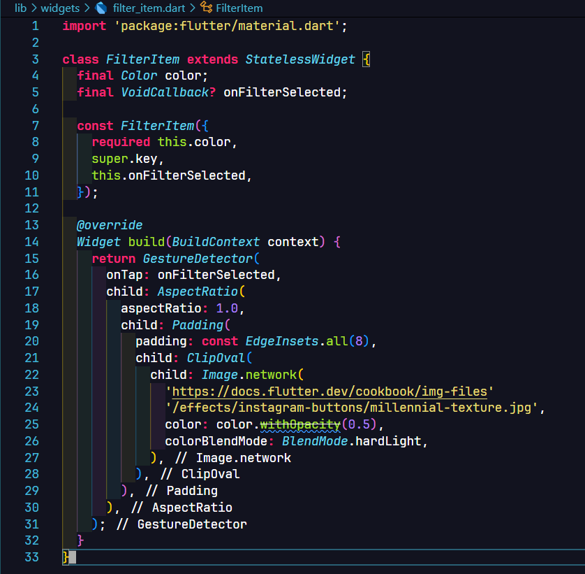

**Nama**: Farrel Augusta Dinata

**Kelas**: TI-3H

**NIM**: 2341720081

---

# Tugas Praktikum 1 - Mengambil Foto dengan Kamera di Flutter

**Langkah 1**

**Langkah 2**

**Langkah 3**

**Langkah 4**

**Langkah 5**

**Langkah 6**

**Langkah 7**

**HASIL PRAKTIKUM 1**

# Tugas Praktikum 2 - Membuat Photo Filter dengan Carousel

**Langkah 1**

**Langkah 2**

**Langkah 3**

**Langkah 4**

**Langkah 5**

**HASIL PRAKTIKUM 2**

Penerapan filter:

---

# Laporan akhir

1. Penggabungan antara praktikum 1 dengan 2 agar bisa menerapkan filter dari gambar yang ditangkap

Jawab: Berikut tampilan terbaru dari penggabungan antara praktikum 1 dan 2

2. Jelaskan maksud void async pada praktikum 1?

Jawab: Penggunaan keyword `async` bertujuan untuk melakukan proses asynchronous pada sebuah function. Proses asynchronous ini merupakan sebuah proses yang dapat menjalakan beberapa tugas sekaligus tanpa menunggu tugas sebelumnya selesai.

3. Jelaskan fungsi dari anotasi @immutable dan @override ?

Jawab: Fungsi dari penggunaan anotasi `@override` bertujuan untuk mengimplementasikan fungsionalitas terbaru dari method yang sama pada class parent. Biasanya diperlukan jika memang perlu untuk kebutuhan modifikasi pada suatu komponen. Contoh yang paling sering ditemui adalah penggunaan `@override` di atas method `build()` di Flutter. 

Sedangkan anotasi `@immutable` berfungsi untuk menandai bahwa objek-objek yang dihasilkan dari class tersebut seharusnya tidak bisa dirubah lagi data-data pada field yang dimiliki.
