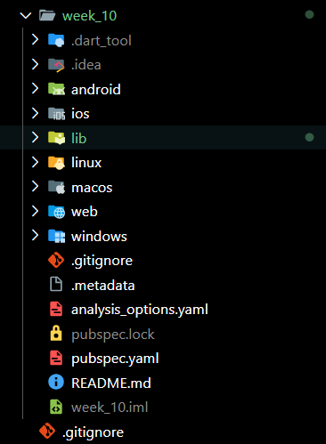

**Nama**: Farrel Augusta Dinata

**Kelas**: TI-3H

**NIM**: 2341720081

---

# Tugas Praktikum 1 - Dasar State dengan Model View




---

## Pertanyaan

1. Jelaskan maksud dari langkah 4 pada praktikum tersebut! Mengapa dilakukan demikian?

Jawab: Langkah 4 yang membuat file baru bernama `data_layer.dart` dengan isi berikut:

```dart
export 'package:week_10/models/plan.dart';
export 'package:week_10/models/task.dart';
```
itu bertujuan untuk memudahkan dalam proses import pada file Dart yang lain. Jika file-file yang lain membutuhkan fungsionalitas yang ada dari model tersebut, maka developer hanya perlu mengimport file `data_layer.dart` yang juga secara otomatis mengimport `plan.dart` dan `task.dart` berkat adanya keyword `export`.

2. Mengapa perlu variabel `plan` di langkah 6 pada praktikum tersebut? Mengapa dibuat konstanta ?

Jawab: Variabel `plan` tersebut bertujuan untuk menyimpan data sementara di memori perangkat pengguna. Data tersebut juga nantinya bisa ditampilkan pada layar aplikasi pengguna pada method `build()`.

3. Lakukan capture hasil dari Langkah 9 berupa GIF, kemudian jelaskan apa yang telah Anda buat!

Jawab: 

4. Apa kegunaan method pada Langkah 11 dan 13 dalam *lifecyle state* ?

Jawab: Bagian tersebut berguna untuk mengatur bagaimana sebuah proses scrolling di aplikasi itu bekerja. Proses ini biasa disebut sebagai `event`. Sebuah event umumnya bisa ditambahkan mengenai `listener` yang berguna untuk mendengarkan atau memperhatikan perubahan yang terjadi dari `event` yang terjadi.

# Tugas Praktikum 2 - Mengelola Data Layer dengan **InheritedWidget** dan **InheritedNotifier**

---

## Pertanyaan

1. Jelaskan mana yang dimaksud `InheritedWidget` pada langkah 1 tersebut! 

Jawab: `InheritedWidget` bertujuan untuk memudahkan dalam umpan balik data antara parent dan child widget. Child widget hany perlu mengakses data melalui atribut dari `BuildContext` tanpa perlu repot parent widget mengumpan data ke child widget.

2. Mengapa yang digunakan `InheritedNotifier`?

Jawab: `InheritedNotifier` perlu digunakan karena untuk mengamati objek yang bersifat `Listenable` seperti `ValueNotifier`, `ChangeNotifier`, atau `Animation`

3. Jelaskan maksud dari method di langkah 3 pada praktikum tersebut! Mengapa dilakukan demikian?

Jawab: Pada lengkah 3 yang menambahkan kode berikut:

```dart
int get completedCount => tasks
  .where((task) => task.complete)
  .length;

String get completenessMessage =>
  '$completedCount out of ${tasks.length} tasks';
```

Method-method tersebut bertujuan untuk memudahkan pengambilan data detail dari properti `tasks`. Contohnya saja untuk mengetahui jumlah `task` yang selesai, maka hanya tinggal memanggil method `completedCount` saja tanpa membuat logic baru di bagian yang lain. Khusus pada bahasa pemrograman `Dart`, bagian `getter` ini sudah memiliki kata kunci tersendiri, yaitu `get`. Ini berbeda dengan bahasa pemrograman lainnya seperti Java yang perlu menuliskan method `getter` secara manual.

4. Lakukan capture hasil dari Langkah 9 berupa GIF, kemudian jelaskan apa yang telah Anda buat!

Jawab:


# Tugas Praktikum 3 - State di Multiple Screens


