**Nama**: Farrel Augusta Dinata

**Kelas**: TI-3H

**NIM**: 2341720081

---

# Tugas Praktikum 1 - Mengunduh Data dari Web Service (API)

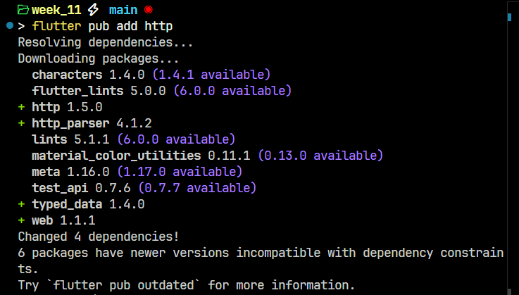

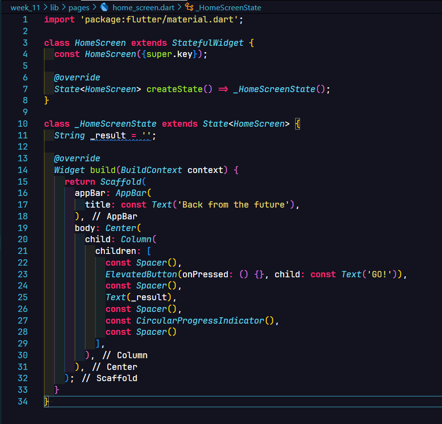

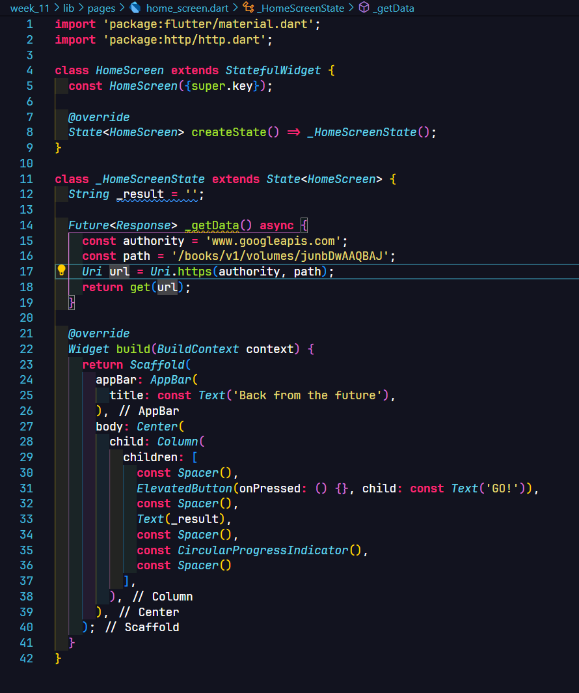

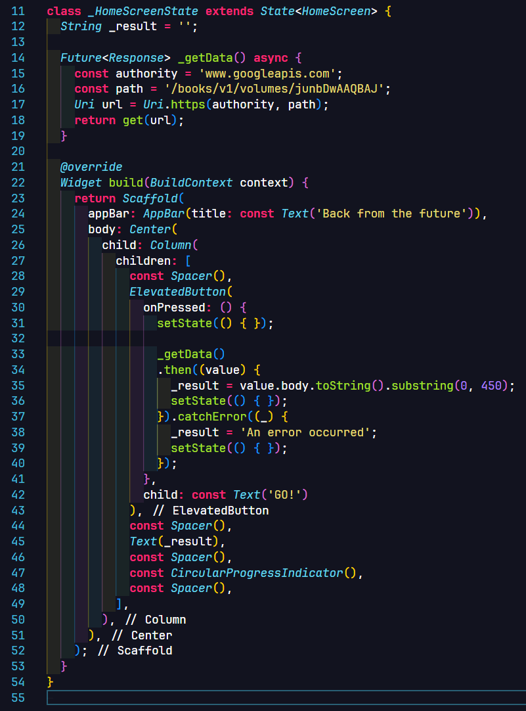

**Pertanyaan:**

1. Tambahkan nama panggilan Anda pada title app sebagai identitas hasil pekerjaan Anda!

    Jawab: 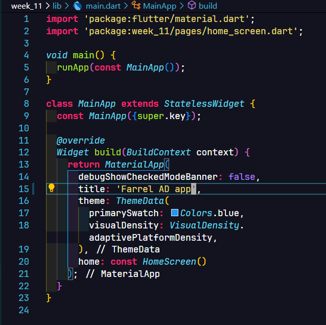

2. Carilah judul buku favorit Anda di Google Books, lalu ganti ID buku pada variabel path di kode tersebut!

    Jawab: Menambahkan buku dengan judul **Generative Deep Learning** yang diterbitkan oleh O'reilly dan dituliskan oleh **David Foster**.

    ID bukut: RKegDwAAQBAJ

    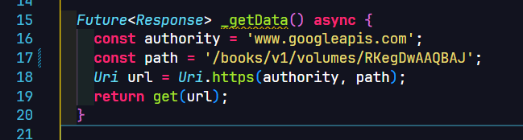

    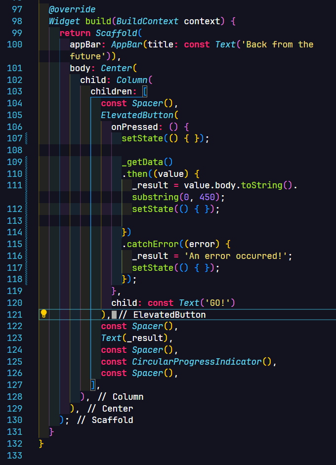

    Hasil percobaan:

    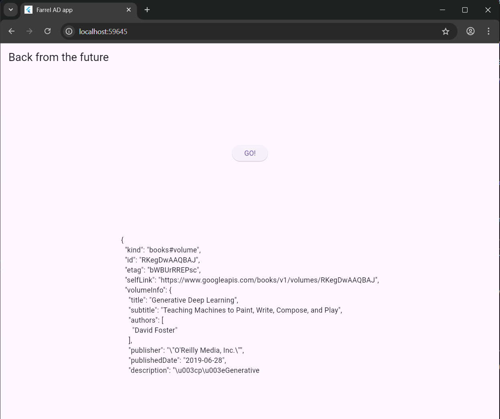

3. Jelaskan maksud kode langkah 5 tersebut terkait `substring` dan `catchError`!

    Jawab: 
    - Fungsi `substring()` : digunakan untuk mengambil sebagian dari keseluruhan data dalam string yang ada. Parameter dari substring adalah `start` dan `end` (opsional). Nilai dari parameter `start` digunakan untuk mengawali pada karakter mana data di string diambil. Jika pada parameter `end` tidak diberikan, maka akan mengambil data dari posisi `start` hingga akhir. Namun, jika `end` diberikan nilai, maka karakter yang diambil akan dihentikan sampai di titik situ saja.
    - Fungsi `catchError()` : ini digunakan untuk menangkap error yang terjadi dari proses asynchronous.

# Tugas Praktikum 2 - Menggunakan `async`/`await` untuk menghindari callbacks

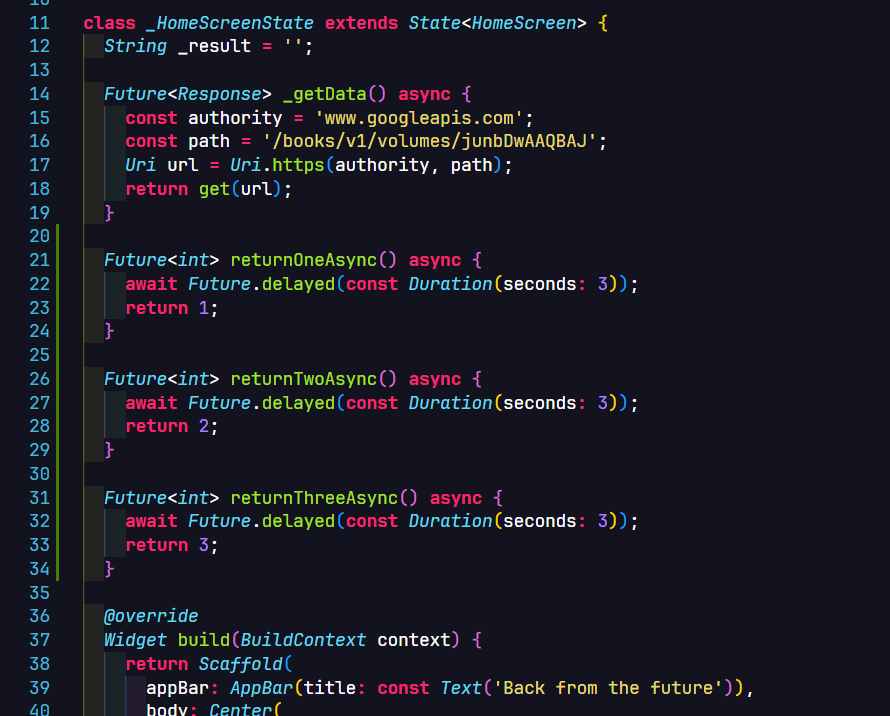

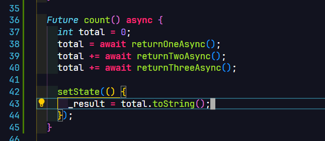

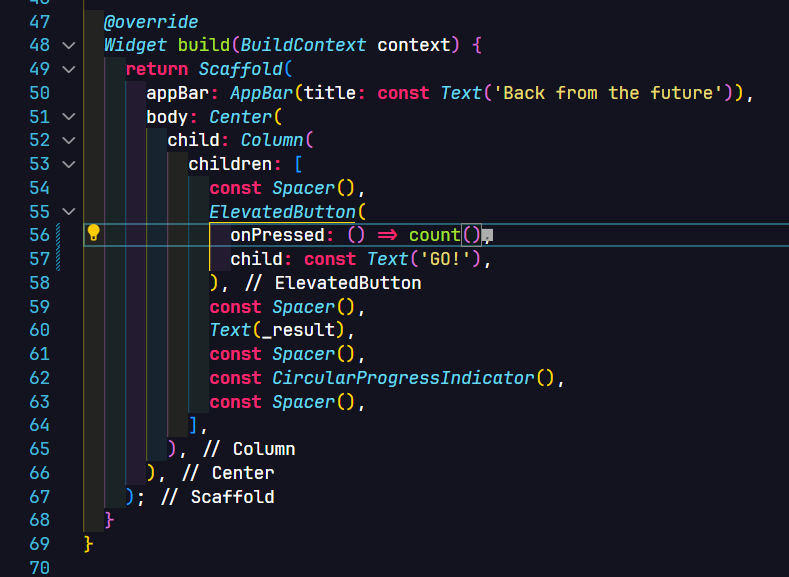

**Preview**


**Pertanyaan:**

1. Jelaskan maksud kode langkah 1 dan 2 tersebut!

    Jawab: Kode pada langkah 1 dan 2 merupakan contoh penggunaan proses **asynchronous** dengan menggunakan keywords `async` dan juga `await`. Dengan penggunaan keywords tersebut, maka sebuah proses tidak perlu menunggu saat ini selesai untuk mengeksekusi proses selanjutnya. Jika ditemukan proses saat ini membutuhkan sebuah delay dalam waktu tertentu, maka program akan otomatis beralih pada aktivitas selanjutnya selagi proses sebelumnya diproses.

# Tugas Praktikum 3 - Menggunakan `Completer` di `Future`

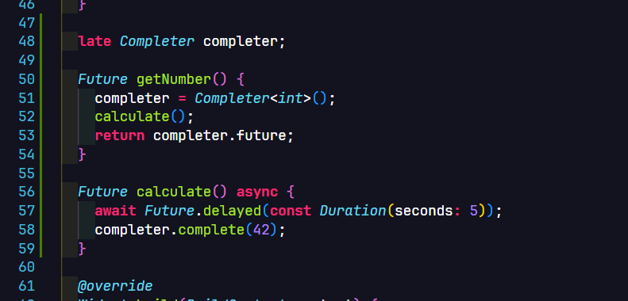

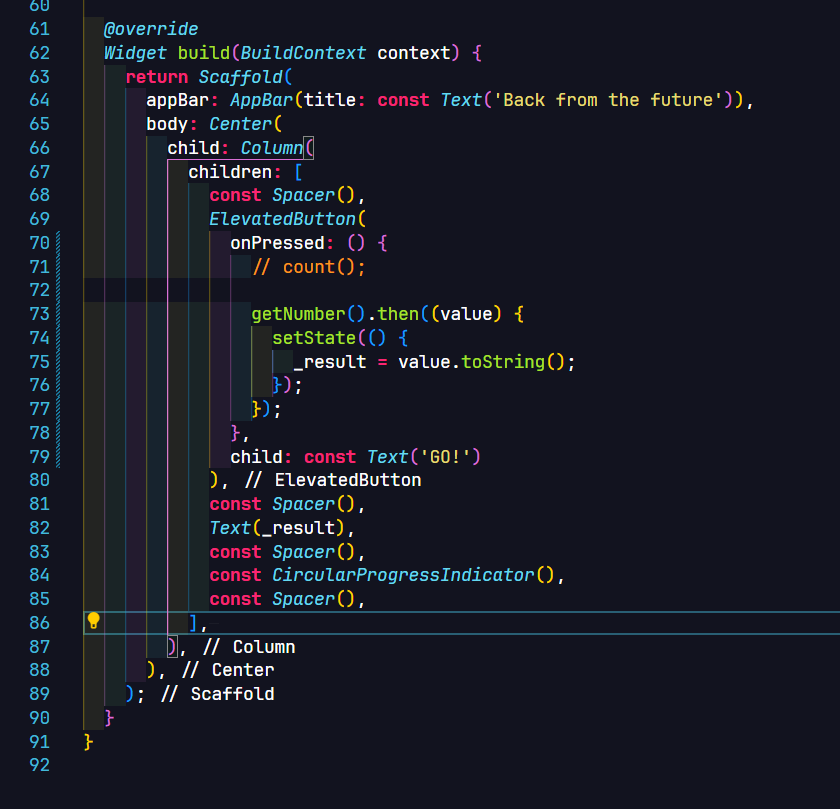

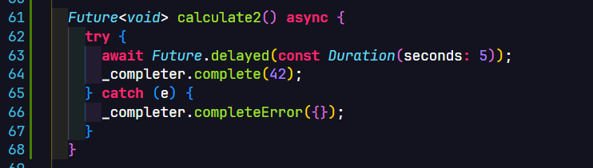

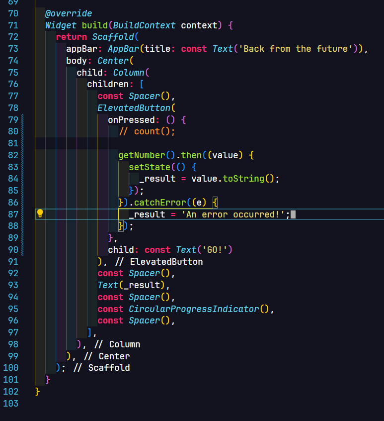

**Preview**


**Pertanyaan:**

1. Jelaskan maksud perbedaan kode langkah 2 dengan langkah 5-6 tersebut!

    Jawab: Kode pada langkah 2 hanya mengatur 1 kondisi di dalam asynchronous, semuanya akan dianggap sukses. Sedangkan, pada langkah 5 dan juga 6 dia juga mengatur pada saat error.

    ```dart
    // ...

    try {
      await Future.delayed(const Duration(seconds: 5));
      _completer.complete(42);
    } catch (e) {
      _completer.completeError({});
    }

    //...
    ```
    Bagian `try-catch` tersebut yang membuat `completer` bisa digunakan untuk mengatur pada proses baik itu sukses ataupun error.


# Tugas Praktikum 4 - Memanggil `Future` secara parallel

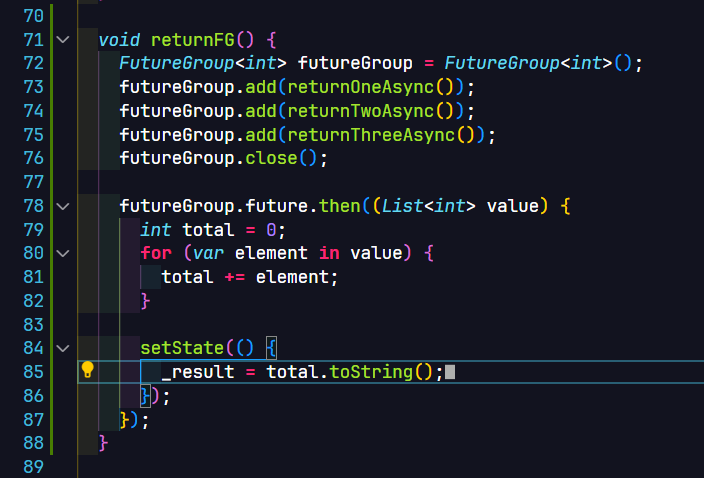

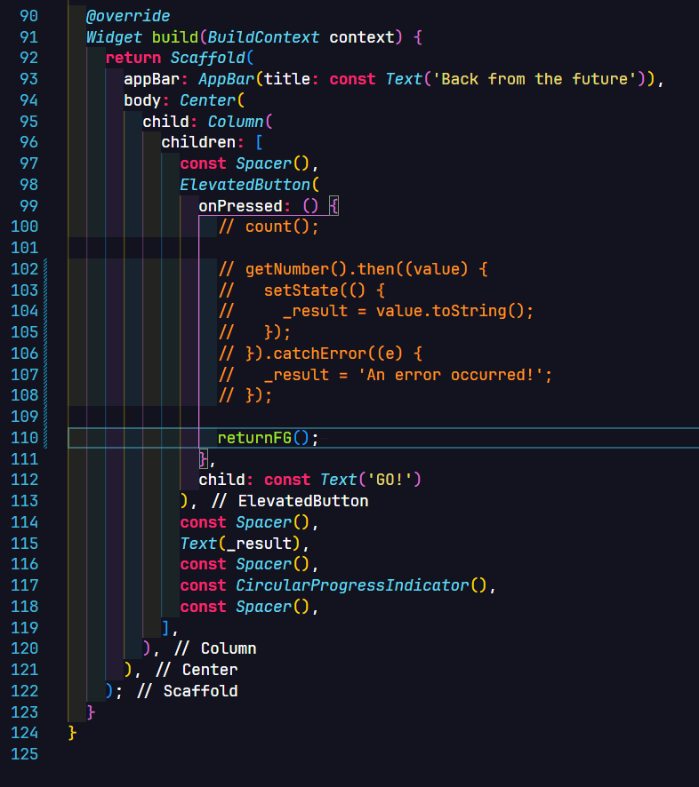

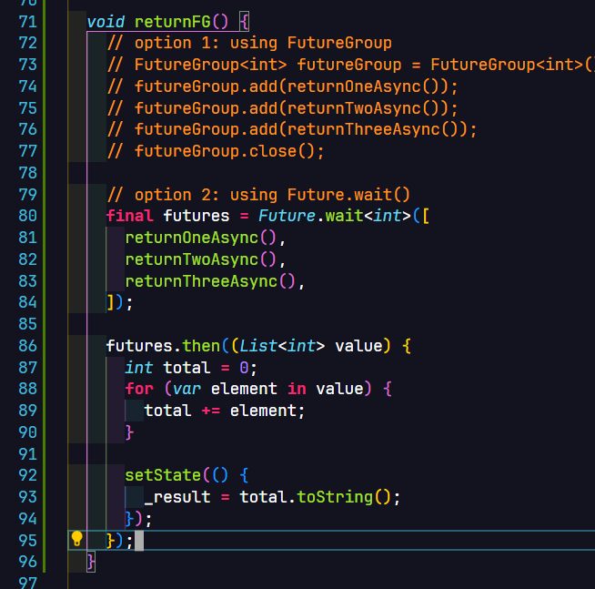

**Preview**


**Pertanyaan:**

1. Jelaskan maksud perbedaan kode langkah 1 dan 4!

    Jawab: Perbedaan yang paling mencolok adalah gaya penulisan untuk mengatur asynchronous process dengan atau tanpa keyword `async / await`. Penulisan dengan cara `async/await` membuat kode masih menyerupai dengan kode Flutter pada umumnya. Namun, di sisi lain, penggunaan `FutureGroup` jauh lebih fleksibel apabila di suatu saat akan ada modifikasi dari kumpulan proses asynchronous saat ini. Untuk menambahkan asychronous baru, maka tinggal menggunakan fungsi `.add()`. 

# Tugas Praktikum 5 - Menangani Respon Error pada Async Code

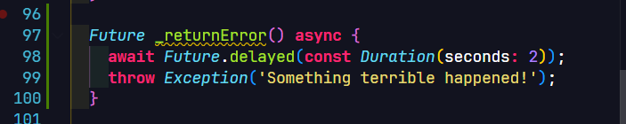

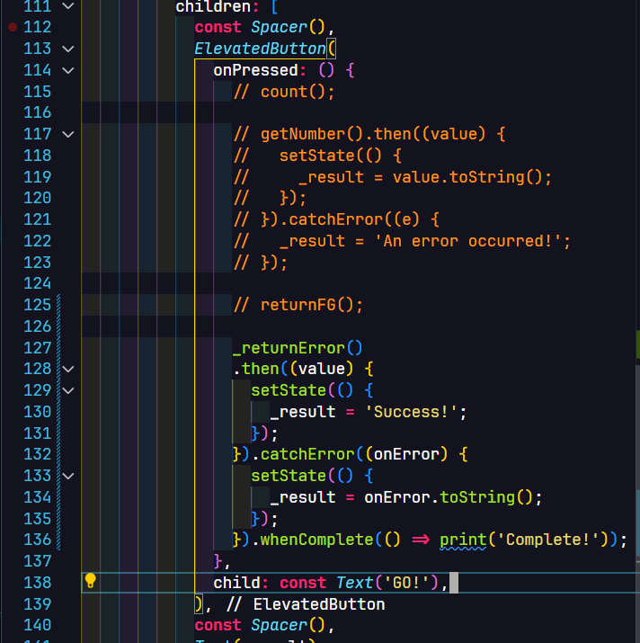

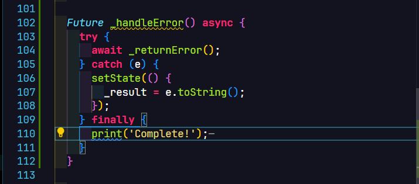

**Pertanyaan:**

1. Capture hasil praktikum Anda berupa GIF dan lampirkan di README!

    Jawab:

   


3. Panggil method `handleError()` tersebut di `ElevatedButton`, lalu run. Apa hasilnya? Jelaskan perbedaan kode langkah 1 dan 4!

    Jawab:

   


    Hasilnya sama saja antara percobaan pertama dan kedua ini. Hasilnya menunjukkan error yang memang sudah disengaja dari function `handleError()` itu sendiri. 
    
    ```dart
    throw Exception('Something terrible happened!');
    ```
    Bagian `throw Exception()` tersebut merupakan trigger yang membuat hasil yang ditampilkan berupa hasil error. Error pasti akan ditangkap pada bagian `catchError()` atau `catch` di struktur `try-catch-finally`.

    Perbedaan yang menonjol hanyalah pada pada gaya pembuatan kode. Langkah pertama implementasi dari function `handleError()` disusun dengan secara berantai (chaining).

    ```dart
    _returnError()
        .then((value) {
            setState(() {
            _result = 'Success!';
            });
        }).catchError((onError) {
            setState(() {
            _result = onError.toString();
            });
        }).whenComplete(() => print('Complete!'));
    ```
    Sedangkan untuk metode yang kedua ditulis dengan lebih menyerupai kode Flutter secara konvensional tanpa membuat callback pada tiap proses setelah asynchronous.
    
    ```dart
    try {
      await _returnError();
    } catch (e) {
      setState(() {
        _result = e.toString();
      });
    } finally {
      print('Complete!');
    }
    ```

# Tugas Praktikum 6 - Menggunakan Future dengan StatefulWidget

# Tugas Praktikum 7 - Manajemen Future dengan StatefulWidget

# Tugas Praktikum 8 - Navigation route dengan Future Function

# Tugas Praktikum 9 - Memanfaatkan `async/await` dengan Widget Dialog
