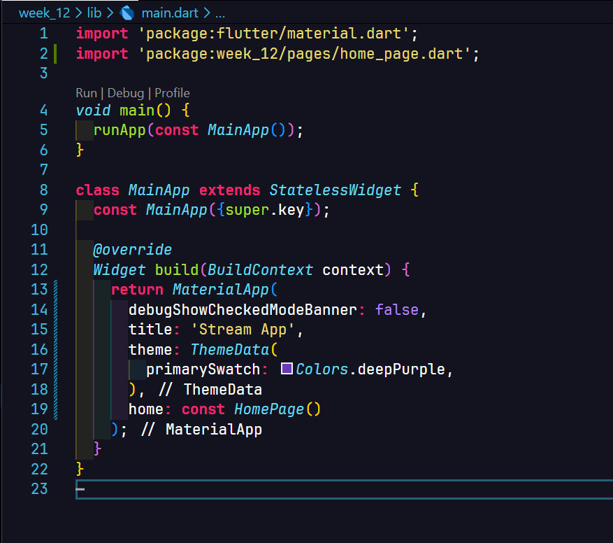
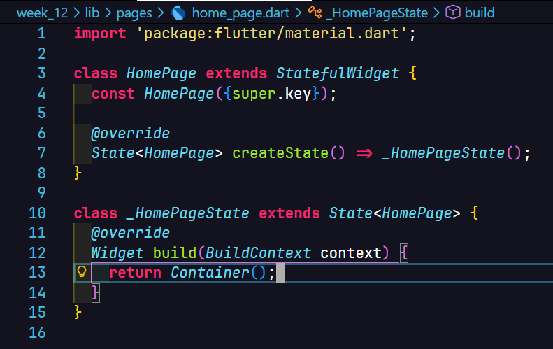
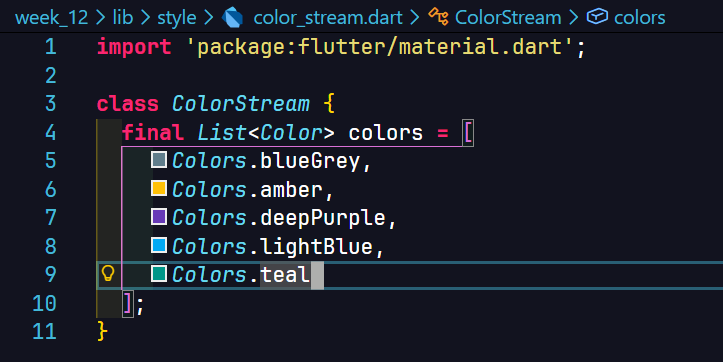
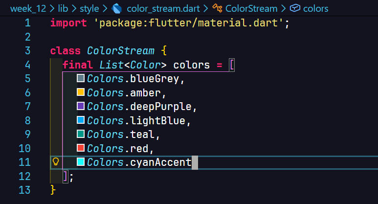
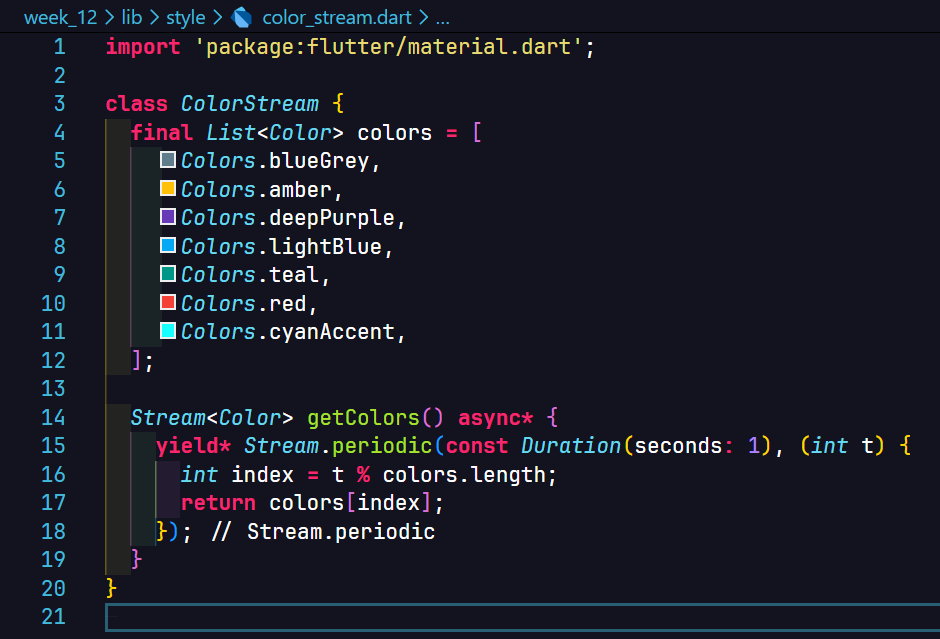
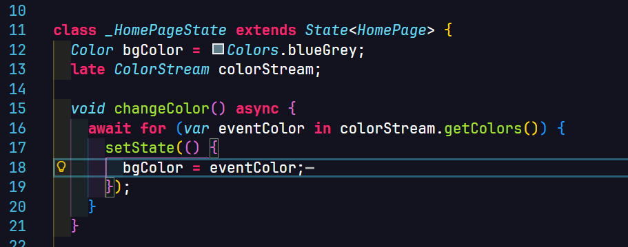
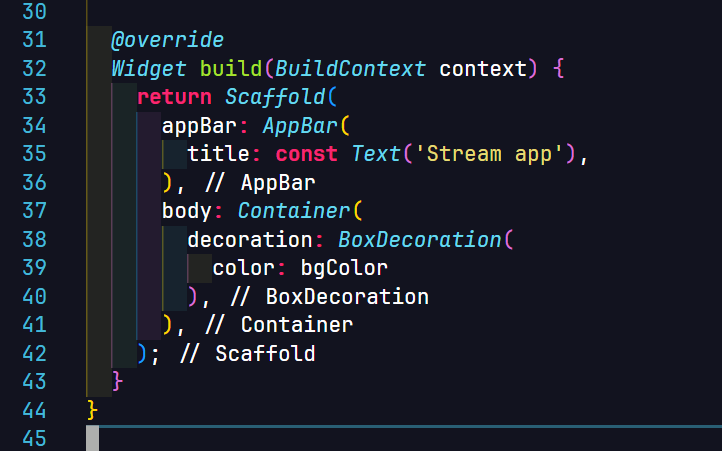
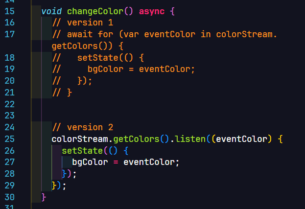

**Nama**: Farrel Augusta Dinata

**Kelas**: TI-3H

**NIM**: 2341720081

---

# Tugas Praktikum 1 - Dart Streams

Jelaskan fungsi keyword `yield*` pada kode tersebut!

Jawab: Keyword `yield*` pada Dart digunakan dalam fungsi `async*` untuk meneruskan seluruh event dari stream lain ke stream yang sedang dibangun. Berbeda dengan `yield` yang hanya mengeluarkan satu nilai, `yield*` mendelegasikan pengiriman data sehingga seluruh aliran dari stream sumber langsung menjadi bagian dari stream keluaran.

Fungsi `getColors()` menghasilkan stream warna yang berubah setiap satu detik. Stream tersebut dibuat menggunakan `Stream.periodic`, di mana nilai `t` digunakan sebagai penghitung yang kemudian diubah menjadi indeks warna melalui operasi modulo, sehingga pemilihan warna berlangsung secara berulang. Dengan `yield*`, seluruh output `Stream.periodic` diteruskan langsung sebagai hasil dari `getColors()`.

Hasil praktikum:

Jelaskan perbedaan menggunakan listen dan await for (langkah 9) !

Jawab: `await for` digunakan untuk melakukan iterasi secara asinkron terhadap sebuah stream dengan cara yang mirip perulangan biasa. Ketika menggunakan `await for`, eksekusi fungsi akan menunggu setiap event dari stream secara berurutan sampai stream tersebut selesai. Dengan demikian, fungsi hanya bergerak ke langkah berikutnya setelah seluruh event stream selesai diproses, sehingga fungsi bersifat blocking terhadap alur eksekusinya sendiri (meskipun tetap asinkron terhadap thread utama Flutter).

Sebaliknya, `listen` mendaftarkan sebuah callback yang akan dijalankan setiap kali stream memancarkan event. Pendekatan ini tidak menghentikan alur eksekusi fungsi; setelah pemanggilan `listen`, fungsi dapat langsung berlanjut atau selesai, sementara callback tetap berjalan selama stream masih aktif. Dengan kata lain, `listen` bersifat non-blocking dan lebih cocok untuk kasus yang membutuhkan respons berkelanjutan terhadap stream tanpa menunggu stream berakhir.

# Tugas Praktikum 2 - Stream Controllers and Sinks

# Tugas Praktikum 3 - Injeksi Data ke Streams

# Tugas Praktikum 4 - Subscribe ke Stream Events

# Tugas Praktikum 5 - Multiple Events Subscription

# Tugas Praktikum 6 - Stream Builder

# Tugas Praktikum 7 - BLoC Pattern