**Nama**: Farrel Augusta Dinata

**Kelas**: TI-3H

**NIM**: 2341720081

---

# Tugas Praktikum 1 - Konversi Dart model ke JSON

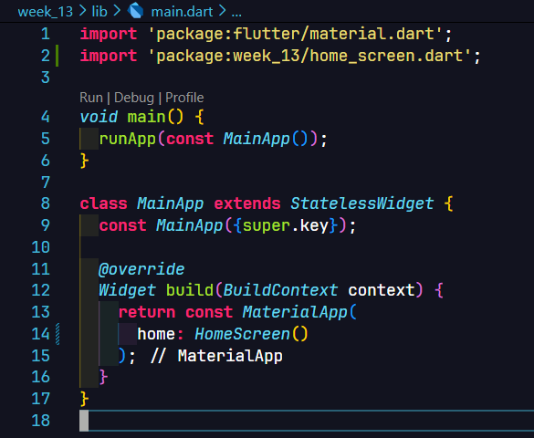

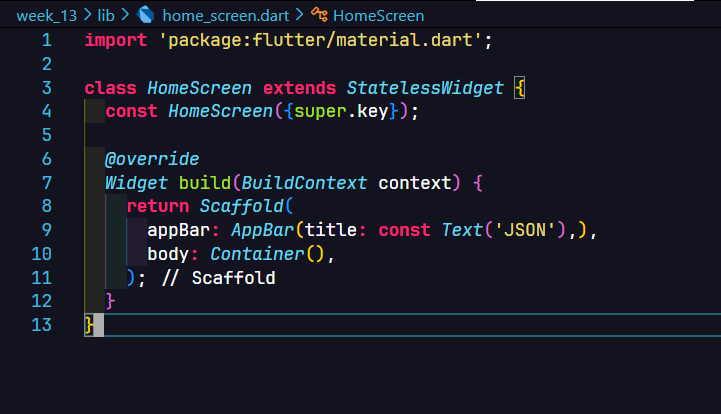

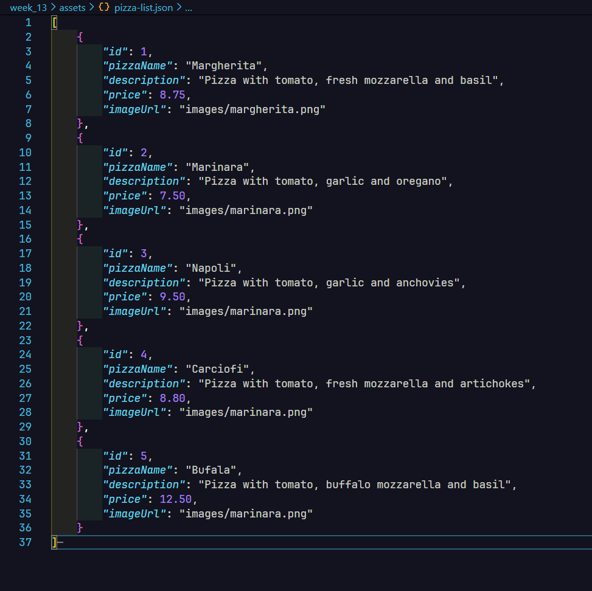

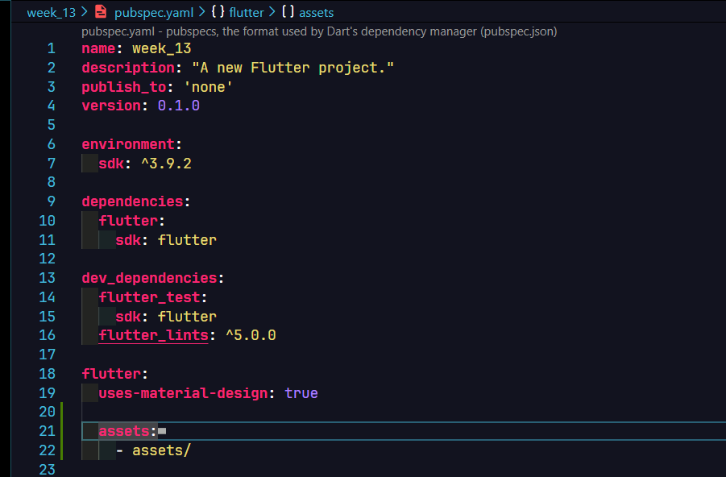

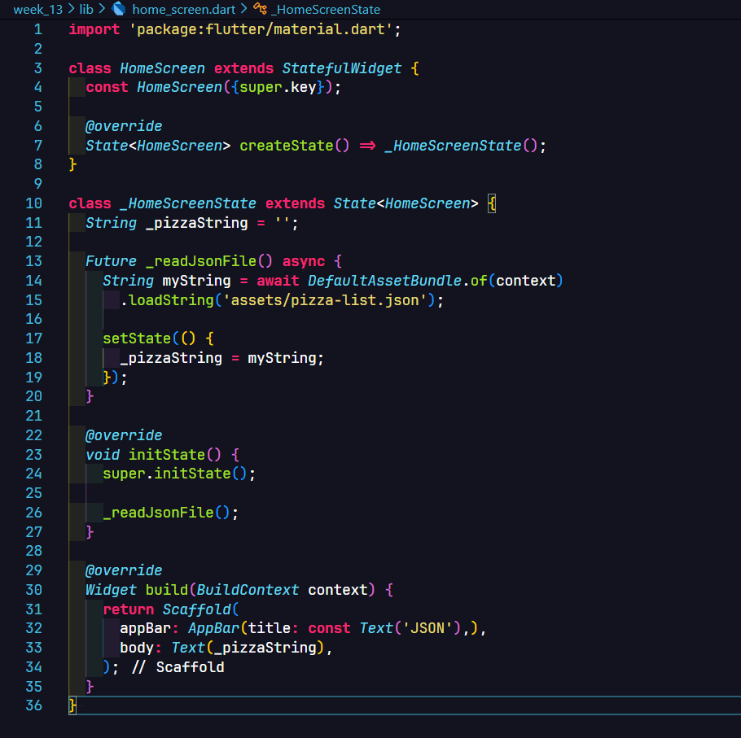

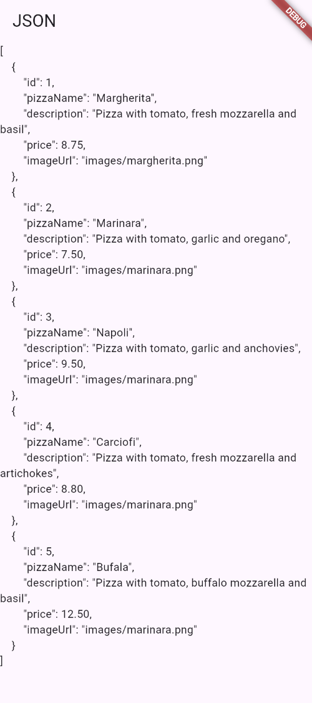

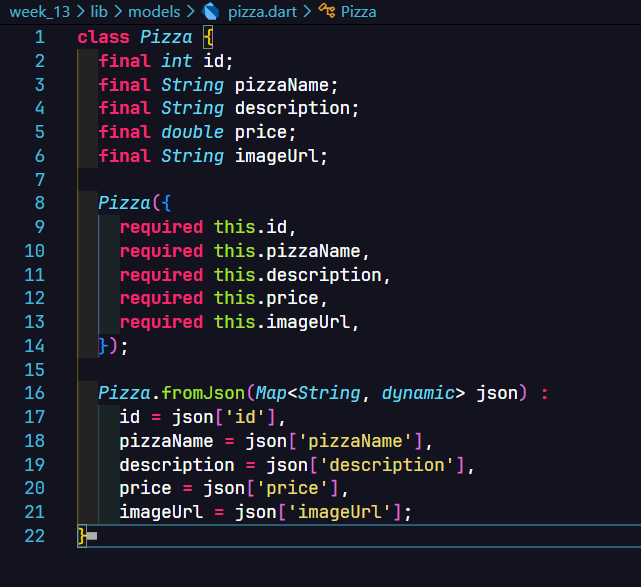

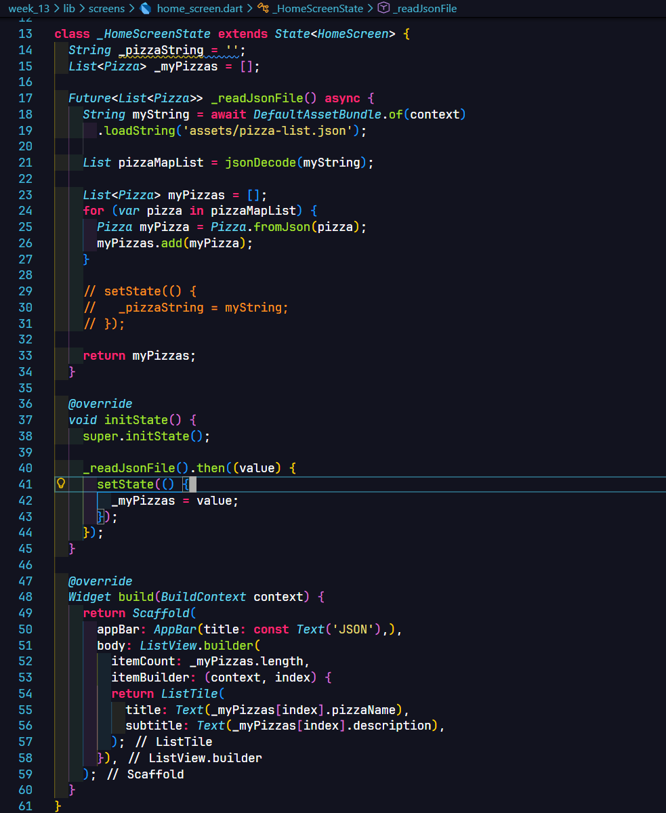

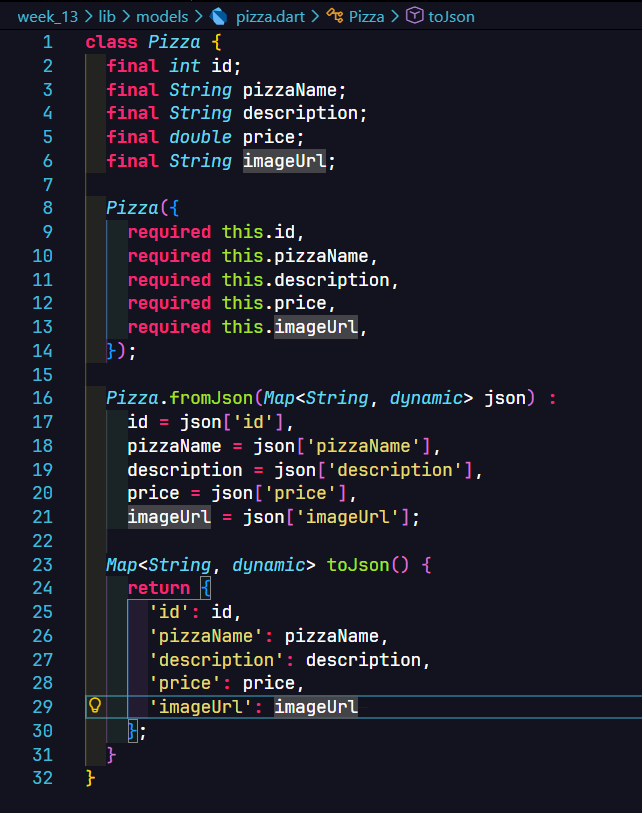

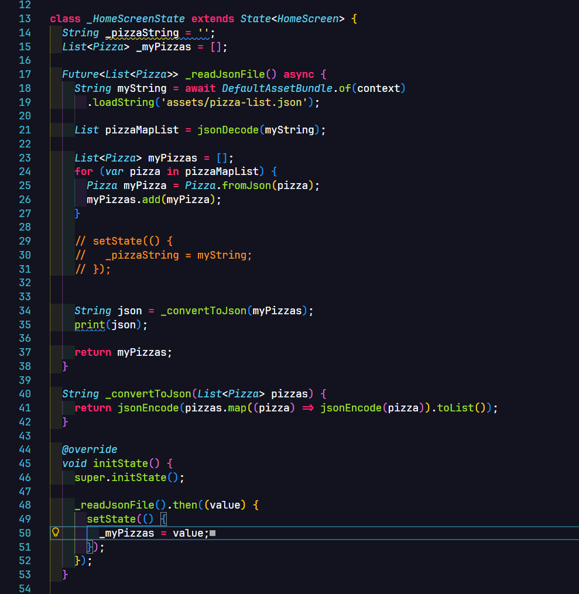

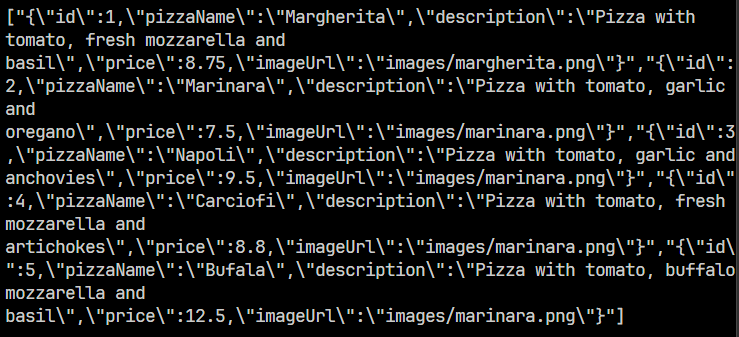

# Tugas Praktikum 2 - Handle kompatibilitas data JSON

# Tugas Praktikum 3 - Menangani error JSON

# Tugas Praktikum 4 - SharedPreferences

# Tugas Praktikum 5 - Akses filesystem dengan path_provider

# Tugas Praktikum 6 - Akses filesystem dengan direktori

# Tugas Praktikum 7 - Menyimpan data dengan enkripsi/dekripsi
